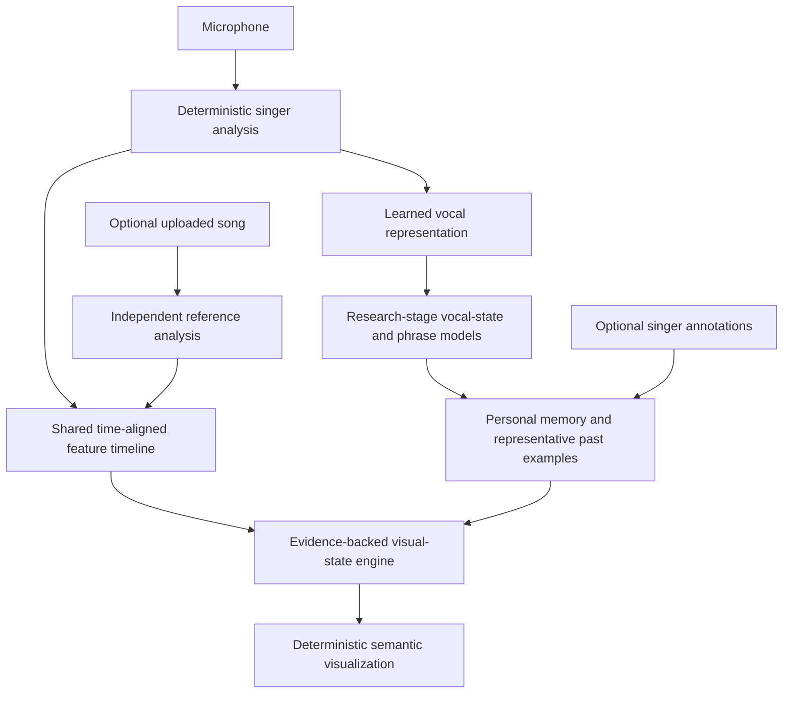
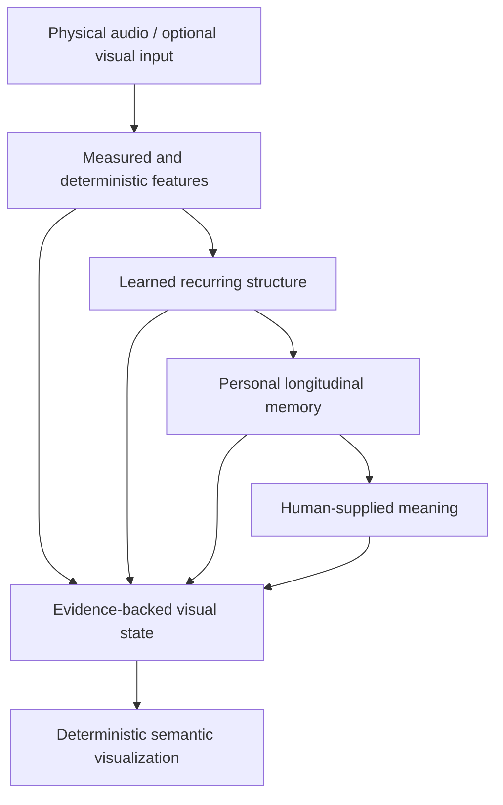

# Resonant Mirror v2

**A local-first project for building an evidence-labeled system that observes how a singer's voice behaves, changes, and becomes more reproducible over time.**

> **Primary principle:** Observe the singer before attempting to teach the singer.

The Resonant Mirror v2 target combines deterministic acoustic analysis, learned vocal representations, personal session history, optional human annotation, and real-time visualization. These are implementation goals, not claims that every capability already works. The project is intended to help a singer understand what their voice is doing and how that behavior evolves — not to grade the singer against one universal ideal.

The authoritative v2 engineering contract is:

**[`RESONANT_MIRROR_V2_CURSOR_IMPLEMENTATION_SPEC.md`](./RESONANT_MIRROR_V2_CURSOR_IMPLEMENTATION_SPEC.md)**

That specification contains the complete numbered requirements, data contracts, implementation phases, research gates, benchmark scenarios, acceptance tests, and self-audit. **If this README and the implementation specification differ, the implementation specification takes precedence for v2 work.**

---

## Project status

Resonant Mirror v2 is implemented incrementally on top of the imported Resonant Singer browser prototype. Phases 0–12 of the specification now have code, tests, and research gates.

Open the observation UI at `pages/resonant_mirror_v2.html` (or `http://localhost:8000/pages/resonant_mirror_v2.html` after `npm run serve`). The legacy visual tuner remains at `index.html`.

Learned outputs (respiration, registration, tension, intensity, support, personal training) stay behind research gates until their evaluation criteria pass. Neural-network weights never update during a live session.

The existing codebase already provides useful foundations including browser microphone analysis, uploaded-audio analysis, deterministic visualizations, breath modeling, session export, offline analysis, and verification scripts. Those foundations should be evolved rather than casually discarded.

However, legacy hand-tuned resonance zones, two-source field geometry, illustrative register physics, and the old whole-system resonance threshold are **research or visualization artifacts**, not validated physiological ground truth. v2 must preserve that distinction.

If the previous root README is archived under `old_files/`, keep it as historical context.

### Plain-language terminology

The project uses technical terms only where they are needed. The full specification contains the canonical glossary. In this README:

- **formant** means a frequency region where the vocal tract strongly shapes sound energy;
- **spectral envelope** means the broad shape of energy across frequencies;
- **periodicity** means how consistently a waveform repeats;
- **learned representation** means a compact numeric description produced by a model for similarity and downstream analysis;
- **classifier** means a model or rule set that assigns probabilities to predefined categories;
- **model checkpoint** means a saved, versioned model state;
- **evidence ancestry** means the traceable record of where a value or visual state came from;
- **calibration** means checking a measurement or probability against a trusted reference;
- **held-out evaluation** means testing on sessions or singers that were not used to train the model.

Avoid unexplained abbreviations and specialist language in new v2 user-facing copy.

---

## What Resonant Mirror should answer

Resonant Mirror should become increasingly good at answering questions such as:

- What pitch did I produce?
- How stable was it?
- How did my sound level change through the phrase?
- How did the spectral envelope and formant structure move?
- What resonance and registration pattern did this passage most resemble?
- How did I move between lower, mixed, and upper production patterns?
- Did a transition appear smooth, abrupt, unstable, or repeatable?
- Where did probable tension evidence increase?
- What did the inhale, onset, sustained phrase, release, and recovery look like as one temporal sequence?
- Which vocal states are becoming more reproducible?
- What does expressive intensity look like for this singer?
- How does the current phrase compare with the singer's own previous examples?
- How does the singer's performance compare with an uploaded reference song while keeping both signals analytically separate?

It should **not** pretend to answer, without sufficient evidence:

- What is the objectively correct way for every person to sing?
- What emotion is inside the singer?
- Which exact internal muscle is tense from microphone audio alone?
- What exact diaphragm motion occurred without a sensor measuring it?
- Whether a legacy visualization threshold represents a real physiological state.

---

## Non-negotiable product principles

### 1. Mirror before teacher

The initial v2 product observes and reflects. It does not silently convert correlations into vocal prescriptions.

Good:

> Across your last eight sessions, this timbre has become more reproducible.

Not part of the initial observation layer:

> Therefore move your resonance upward next time.

Teaching may become a later, explicitly designed layer after the observation system is validated.

### 2. Personal progress before universal scoring

There is no master `VOICE SCORE`.

Progress should be self-relative and multidimensional, including where supported by data:

- pitch stability;
- observed, comfortable, and repeatedly stable range;
- repeatability;
- phrase duration;
- transition smoothness;
- vibrato consistency;
- resonance-pattern reproducibility;
- support-related coordination consistency;
- expressive-intensity trajectory control.

### 3. Measurement, inference, interpretation, and simulation remain distinct

Every user-facing value must preserve traceable evidence ancestry.

| Evidence class | Example |
|---|---|
| **Measured** | microphone samples; calibrated physical quantity only when a real calibration exists |
| **Derived** | fundamental-frequency estimate, cents error, vibrato extent, spectral centroid, relative digital signal level |
| **Inferred** | head-dominant pattern, probable inhale, probable tension evidence |
| **Personal inference** | similarity to previous user-labeled “comfortable head voice” examples |
| **Human-labeled** | warm, raw, intimate, effortless, strained |
| **Simulated** | diaphragm animation when no diaphragm sensor exists |
| **Legacy hypothesis** | hand-tuned prototype resonance behavior |
| **Unknown** | insufficient evidence for a defensible claim |

A learned or simulated result must never masquerade as a directly measured physiological fact.

### 4. Visuals cannot invent evidence

> **The visualization may transform evidence; it may never create evidence.**

Every dynamic visual must be traceable to upstream measured data, deterministic calculations, human labels, or an explicitly identified model inference. Missing, stale, or low-reliability evidence must move the visual toward **unknown / neutral**, not toward a plausible guess.

A generative model must not directly decide semantic visual state. Decorative particle motion may vary, but the meaning of the visualization must remain deterministic from its evidence and versioned mapping.

Development builds should provide an evidence inspector that answers: **Why is this visual active?**

### 5. No internal-emotion inference

Resonant Mirror may learn **human-perceived expressive intensity**.

It must not claim to infer a singer's private emotional state from audio or video.

### 6. No clinical claim

Resonant Mirror is not a medical device, diagnostic system, therapy, validated biofeedback device, or wellness intervention.

---

## System architecture



The system operates at three timescales:

```text
DURING SESSION
microphone / uploaded song
        ↓
deterministic acoustic analysis
        ↓
validated machine-learning inference
        ↓
personal similarity lookup
        ↓
real-time visualization

BETWEEN SESSIONS
validated session material
        ↓
dataset construction / annotation
        ↓
training or fine-tuning experiments
        ↓
evaluation / regression testing
        ↓
versioned checkpoint

NEXT SESSION
load only a checkpoint that passed its required gate
```

**Neural-network weights must not change during a live singing session.**

---

## Input modes

### Microphone-only

Analyze the singer in real time.

### Uploaded song plus microphone

The reference recording and microphone are separate sources. They must:

1. be decoded independently;
2. be analyzed independently;
3. retain separate feature streams and evidence ancestry;
4. share a common timeline only for comparison;
5. never be silently mixed before feature extraction.

Headphones should be strongly encouraged during simultaneous playback and microphone capture. Reference leakage into the microphone is a data-quality problem, not singer behavior.

Commercial songs are **user-supplied benchmark material**, not bundled training assets. Training on external commercial material requires a separate rights review.

---

## Dense temporal feature timeline

The core data model is a set of time-aligned streams, not one number per phrase.

```text
TIME ───────────────────────────────────────────────────────────►

Pitch                 ───────────≈≈≈≈≈≈≈≈≈────────────────────
Relative sound level  ─────╭──────────────╮___________________
Formant trajectories  ───╮____╭────────────╮_________________
Periodicity            ───██████████████████▇▆________________
Breath evidence        ─╮_______________________╭_____________
                        inhale                  release
Registration pattern   ─ chest ─ transition ─ mixed ─ head ──
Support evidence       ───▂▃▄▅▆▇████████▇▆▅___________________
Tension evidence       ───▁▁▂▃▄▆▇██▆▃▂_______________________
Expressive intensity   ───▂▂▃▄▅▆▇█▇▆▅________________________
```

This shared feature timeline is intended to support visualization, phrase analysis, learned inference, personal comparison, long-term analysis, and research diagnostics.

---

## Deterministic acoustic layer

Machine learning should not replace calculations we already understand.

The deterministic layer should own quantities such as:

- fundamental frequency;
- musical-note mapping;
- pitch deviation in cents;
- frequency spectrum and spectral envelope;
- harmonic structure;
- spectral centroid;
- spectral rolloff;
- spectral tilt;
- root-mean-square amplitude;
- relative digital signal level;
- note duration;
- onset timing;
- timing relative to a beat;
- vibrato rate and extent;
- other directly calculable acoustic statistics.

If an established pitch estimator reports approximately `438.9 hertz`, a neural network is not needed to decide that the result is approximately A4.

### Sound level and decibels

Normal consumer microphone input should default to **relative digital signal level**, such as decibels relative to full scale.

Do **not** claim calibrated physical sound-pressure level unless a real calibration workflow exists.

Sound level is a dense temporal feature. Useful derived properties include:

- average level;
- minimum and maximum;
- dynamic range;
- attack steepness;
- rise and fall rates;
- peak duration;
- release behavior;
- local variance;
- relationships with pitch, resonance, texture, and phrase structure.

More decibels must never be equated with more emotion or better singing.

---

## Resonance and registration

Resonance is a major v2 data family.

Microphone audio may contain acoustic evidence related to vocal-tract filtering, including:

- formant estimates;
- formant trajectories;
- formant bandwidths where reliable;
- spectral-envelope shape;
- harmonic-energy distribution;
- resonance-pattern movement through time.

Pitch and resonance remain distinct. Two takes can have almost the same fundamental frequency and sound level while exhibiting different spectral and formant organization.

### Chest, head, and mixed behavior

Use normal vocal-pedagogy terminology, but treat “chest,” “head,” and “mixed” as **registration and resonance-pattern descriptions**, not proof that sound physically resides in a named cavity.

The research target is the trajectory:

```text
lower / chest-dominant pattern
        ↓
register-transition behavior
        ↓
mixed coordination
        ↓
upper / head-dominant pattern
```

Estimating the following patterns is a **research target**, not a current proven capability:

- smooth redistribution;
- abrupt flip;
- strained upward carry;
- unstable landing;
- repeatable integrated mixed coordination;
- deliberate stylistic break when identified as intentional.

### Whole-system resonance

In v2, “whole-system resonance” is a **research target for integrated coordination**, not the legacy prototype's hard-coded whole-system badge.

Candidate evidence may include coordinated behavior among:

- registration;
- resonance trajectories;
- pitch stability;
- sound-level control;
- periodicity;
- respiratory timing;
- support-related evidence;
- strain or tension evidence;
- repeatability;
- user descriptions such as free, connected, open, effortless, or ringing.

The system must be allowed to say **unknown**.

---

## Respiration and support-related coordination

### Respiratory events

Respiratory-event classification is a **research target**. The system should estimate respiratory states as temporal patterns rather than forcing every frame into a binary inhale/exhale label.

Initial candidates include:

- probable inhale;
- probable exhale or non-phonated release;
- phonated exhalation;
- phrase-ending release;
- uncertain respiratory event.

A phrase may be represented as:

```text
inhale
  ↓
onset
  ↓
sustained phonation
  ↓
resonance / registration / intensity development
  ↓
release
  ↓
recovery / next breath
```

Audio-only inference cannot establish exact lung volume, diaphragm displacement, or respiratory muscle force.

### How breath events are captured

The current browser path should use the normal microphone stream already available to the application. There is no assumption that the browser or phone provides a built-in validated `inhale started` / `exhale started` event. Resonant Mirror v2 must supply and validate its own local respiratory-event classifier before that output is treated as a trusted feature.

```text
browser microphone
      ↓
dense acoustic features
      ↓
local respiratory classifier
      ↓
temporal smoothing
      ↓
inhale | phonated exhale | unphonated exhale | pause | unknown
```

For a future Apple-native version, Apple's audio engine and Sound Analysis framework can host microphone-stream classification, including a custom Apple Core ML model. For future Android-native work, the platform's microphone-recording interfaces can provide the audio stream, with less-processed input investigated where supported. These platform frameworks provide audio infrastructure; they are **not** treated as built-in validated breath-phase sensors.

Apple HealthKit and Android Health Connect can also store **respiratory rate** records, such as breaths per minute. Those are useful contextual or validation data, but they do not identify the phase boundaries of individual inhales and exhales and therefore must not directly drive the breath animation.

Far-field bedside respiration is outside the initial v2 scope unless separately implemented and validated.

### Supported voice

Do **not** implement one binary `SUPPORTED` classifier as though support were a single directly measurable quantity.

Treat support as a learned coordination pattern that may combine:

- respiratory preparation;
- onset behavior;
- harmonic organization;
- stable or intentionally controlled pitch;
- stable or intentionally controlled sound level;
- phrase endurance;
- resonance continuity;
- repeatability;
- singer-reported comfort or effort;
- later, appropriately collected expert annotation.

Personal comparison is central. A new phrase may eventually be compared with previous phrases labeled by the singer as:

- comfortable;
- effortless;
- supported;
- strained;
- running out of breath;
- pressed;
- unstable.

Outputs should be framed as **support-related coordination evidence**, not anatomical certainty.

---

## Tension evidence

Tension is a graded inference, not a diagnosis and not a binary label.

Potential audio evidence may include combinations of:

- pressed onset behavior;
- reduced periodic stability;
- abrupt spectral change;
- transition instability;
- harsh continuation;
- unexpected pitch instability under load;
- end-of-phrase deterioration;
- similarity to previous takes the singer labeled tense or strained.

A later optional camera subsystem may add visual evidence such as jaw rigidity, facial strain, chin lift, neck engagement, shoulder elevation, or posture compression. Those remain inferences from observable motion, not direct muscle-force measurements.

Singer self-report is also valuable evidence.

### Orange-red tension visualization

The required tension visual language is a **dim amber / orange → orange-red progression** whose opacity, density, or contraction increases with tension evidence and confidence.

When localization is defensible, the glow may be associated with regions such as:

- jaw / face;
- throat / neck;
- shoulders / upper torso;
- generalized whole-field effort.

The glow represents **tension evidence**, not proof that a specific muscle was measured as tense.

---

## Anatomy and aura visualization

The v2 anatomy view should include representations of:

- head and skull;
- jaw and face;
- nasal and oral spaces;
- pharyngeal region;
- larynx / vocal-fold location;
- trachea;
- lungs;
- rib cage;
- sternum;
- xiphoid region;
- diaphragm;
- abdomen / lower torso.

Layered or transparent anatomy should make it clear which information is measured, inferred, or simulated.

### Simulated breathing anatomy

If no sensor directly measures body motion:

```text
probable respiratory event
        ↓
respiratory-state estimate
        ↓
deterministic simulated rib / diaphragm animation
```

The animation is explanatory visualization, not medical imaging.

### Aura semantics

The aura is not a reward meter.

| Visual behavior | Meaning |
|---|---|
| **coherence / stability** | sustained technical alignment or control |
| **energy / motion** | expressive intensity |
| **orange-red localized glow** | tension / strain evidence |
| **resonance field** | measured and/or inferred resonance state with evidence ancestry |
| **persistence** | continuity through time rather than instant judgment |

A controlled soft phrase may create a stable, delicate field. A climactic scream may create a highly energetic field. Neither is inherently better.

---

## Learned vocal representation

The first serious PyTorch model should remain small and inspectable.

Provisional starting architecture:

```text
audio window
    ↓
log-mel spectrogram
    ↓
small convolutional neural network
    ↓
approximately 64-dimensional vocal representation
    ↓
small task-specific prediction heads
```

The dimensionality and model size are provisional research parameters.

The shared representation may later support:

- human-perceived expressive intensity;
- clean versus distorted production;
- breathiness;
- registration candidates;
- transition behavior;
- personal similarity;
- support-related coordination;
- tension evidence.

Interpretable deterministic features must remain available in parallel.

---

## Phrase-level expressive intensity

Expression and coordination have temporal shape.

A longer-timescale model should eventually represent trajectories such as:

```text
restrained
   ↓
build
   ↓
tension
   ↓
peak
   ↓
release
```

This supports specific feedback such as:

> You reached a similar expressive peak as before, but the transition into it was smoother.

Resonant Mirror may learn **human-perceived expressive intensity**. It must not convert that into a claim about the singer's internal emotional state.

### Pairwise annotation

Prefer pairwise judgments over invented numerical precision:

> Which passage sounds more expressively intense, A or B?

Within-performance comparisons are especially useful because more potentially misleading variables remain constant.

Training data must deliberately prevent shortcuts such as:

- louder = more intense;
- more distortion = more intense;
- higher pitch = more intense;
- crowd noise = more intense;
- more reverberation = more intense.

---

## Personal memory and learning

Personalization operates on two timescales.

### Fast memory

Store validated representations and metadata without changing model weights.

Possible personal prototypes include:

- comfortable head voice;
- preferred grit;
- stable A4;
- soft intimate tone;
- preferred mixed transition;
- singer-defined supported phrase.

### Slow model learning

Fine-tuning or retraining happens only between sessions and only after sufficient validated data exists.

Every trained model must be:

- versioned;
- tied to a dataset version;
- evaluated on held-out data;
- regression-tested;
- rejectable if it degrades important behavior.

Ordinary user behavior must not silently update neural-network weights.

### Human annotation

Optional singer labels may include:

- warm;
- bright;
- raw;
- breathy;
- powerful;
- restrained;
- intimate;
- gritty;
- clear;
- comfortable;
- effortless;
- supported;
- strained;
- pressed;
- jaw tight;
- throat tight.

Personal labels must remain editable. Human interpretation is not immutable ground truth.

---

## Evaluation rules

### Session-held-out evaluation

Do not randomly split neighboring windows from the same recording across training and validation.

Illustrative early split:

```text
Sessions 1–8  → training
Session 9     → validation
Session 10    → test
```

As the corpus grows, the general model must also support **speaker-held-out evaluation**.

### Tests for shortcut learning and misleading correlations

Explicitly test whether a model has accidentally learned:

- singer identity;
- microphone identity;
- recording environment;
- crowd noise;
- accompaniment density;
- loudness;
- distortion;
- pitch height;
- genre;
- recording era.

### Learned-space diagnostics

Inspect projected vocal representations and ask:

- Do singers cluster mainly by identity?
- Does distortion dominate?
- Does register dominate?
- Do restrained and intense phrases separate?
- Do multiple intensity mechanisms share structure?
- Do personal states become reproducible clusters?

A failed hypothesis is useful research information and should not be hidden.

---

## Privacy and training rights

Resonant Mirror v2 is **local-first**.

Default direction:

```text
microphone
   ↓
local device
   ├── deterministic features
   ├── machine-learning inference
   ├── personal representations
   ├── personal history
   └── optional local fine-tuning in a later phase
```

Raw voice recordings are sensitive data.

The implementation must distinguish at least:

- raw audio;
- deterministic acoustic features;
- learned representations;
- human labels;
- session history;
- model checkpoints.

No remote transfer should occur by default.

Deletion must eventually cover recordings, sessions, annotations, personal prototypes, personal history, and defined derived personal data.

External commercial recordings are not automatically authorized training data. Production training requires explicit rights review.

---

## Benchmark scenarios

The v2 specification defines progressive functional benchmarks.

| Scenario | Primary purpose |
|---|---|
| **Microphone sustained note** | pitch, sound level, spectrum, resonance evidence, traceable evidence ancestry |
| **Siren / registration transition** | transition segmentation and lower → mixed → upper behavior |
| **Phrase with breath** | inhale, onset, phonation, release, respiration visualization |
| **Repeated same phrase** | representation repeatability and personal prototypes |
| **User-supplied _Smells Like Teen Spirit_** | distortion, rapid intensity change, lower-to-upper behavior, reference separation |
| **User-supplied _Earth Song_** | large dynamic trajectory, sustained build and release, clean high intensity |

The two named songs are benchmark examples, not bundled assets, universal labels, or automatically permitted training data.

---

## Implementation phases

Implement v2 in order.

| Phase | Goal |
|---|---|
| **0** | repository audit, contracts, evidence ancestry, legacy isolation |
| **1** | dual input and shared timeline |
| **2** | deterministic dense acoustic features |
| **3** | resonance analysis and anatomy v2 |
| **4** | respiratory-event pipeline |
| **5** | registration and transition observation |
| **6** | tension-evidence visualization |
| **7** | dataset pipeline and small PyTorch encoder |
| **8** | expressive-intensity ranking |
| **9** | personal memory and prototypes |
| **10** | support-related coordination |
| **11** | phrase-level temporal model |
| **12** | optional personal model training |

Each phase has explicit acceptance gates in `RESONANT_MIRROR_V2_CURSOR_IMPLEMENTATION_SPEC.md`.

Do not expose a research-stage output as a trusted feature merely because its interface can be mocked before its validation path exists.

---

## Existing repository and legacy prototype

The existing Resonant Singer implementation should be mapped into v2 before architectural changes are made.

Documented legacy modules include:

```text
src/physics.js
src/field.js
src/audio.js
src/breath.js
src/anatomy.js
src/renderer.js
src/ui.js
src/views.js
src/env.js
src/sessions.js
src/articulation.js
src/notices.js

tools/graph_engine/
tools/synthetic_sessions/
tools/journal_noticer/
tools/verify_all.sh
tools/physics_verify.js
```

### Legacy behavior that must stay isolated

- hand-tuned anatomical resonance-zone frequencies;
- coupled-oscillator visualization assumptions;
- two-source interference geometry;
- spectral-null presets;
- the old hard-coded whole-system resonance badge;
- illustrative register-transition physics.

These may remain useful research visualizations and sandboxes. They must not silently become physiological ground truth, machine-learning labels, or vocal prescriptions.

---

## Quick start: current repository

The following commands are retained from the existing project structure.

```bash
# Development server
npm run serve

# Alternative simple server
python3 -m http.server 8080

# Existing main tuner
# http://localhost:8000/index.html

# Resonant Mirror v2 observation UI
# http://localhost:8000/pages/resonant_mirror_v2.html

# Existing Release Principle sandbox
# http://localhost:8080/pages/release_principle.html
```

### Verification

```bash
./tools/verify_all.sh
node tools/physics_verify.js
```

Any change touching legacy register physics must continue to satisfy the relevant falsification harness unless the v2 specification deliberately replaces that isolated subsystem and updates its tests.

### Portable legacy build

```bash
npm run build:dist
```

### Existing offline graph pipeline

```bash
cd tools/graph_engine
python3 ingest.py path/to/sessions.jsonl
python3 homology.py
python3 neti_neti.py
python3 articulate.py
```

### Existing synthetic machine-learning reference pipeline

```bash
cd tools/synthetic_sessions
python3 generate.py -n 4000 --balance -o sessions_balanced.jsonl
python3 train.py --data sessions_balanced.jsonl
```

These pipelines are reference infrastructure. New v2 learned systems must follow the v2 dataset, evidence-ancestry, held-out evaluation, and research-gating requirements.

---

## Documentation map

### Authoritative v2 document

- **`RESONANT_MIRROR_V2_CURSOR_IMPLEMENTATION_SPEC.md`** — complete v2 product and engineering contract.

### Existing architecture and research documents

Where retained:

- `docs/ARCHITECTURE.md`
- `docs/INTERFERENCE_MODE_DESIGN.md`
- `docs/AUDIO_PIPELINE_DESIGN.md`
- `docs/ENGINE_ROADMAP.md`
- `docs/VERIFICATION.md`
- `docs/JOURNAL_NOTICER_DESIGN.md`
- `docs/methodology/README.md`
- `docs/methodology/assumptions.md`
- `docs/methodology/active_ignorance_nodes.md`
- `docs/methodology/isomorphic_mappings.md`
- `tools/graph_engine/README.md`
- `vibrational-system.md`
- `essay-draft.md`

Legacy documentation is useful context. The v2 specification supersedes incompatible product behavior.

---

## Cursor implementation rules

Before changing code, Cursor should:

1. Read this README and the entire v2 implementation specification.
2. Audit the existing repository and map modules to v2 requirements.
3. Implement one numbered phase at a time.
4. Preserve verified legacy behavior unless v2 explicitly supersedes it.
5. Add or update tests with every phase.
6. Preserve traceable evidence ancestry on every measured, derived, inferred, personal, human-labeled, simulated, legacy, or unknown value.
7. Keep uploaded reference audio and microphone audio independent through feature extraction.
8. Never promote a visualization heuristic into a physiological fact.
9. Do not update neural-network weights during a live session.
10. Do not silently train on ordinary user behavior.
11. Keep experimental thresholds configurable and marked provisional.
12. Do not expose research-stage learned predictions as trusted product features before their validation gate passes.
13. Do not make clinical, diagnostic, psychological-state, or wellness claims.
14. Do not add prescriptive vocal coaching to the initial observation system.
15. If implementation requires unsupported science, register an unresolved assumption instead of inventing a value.
16. Every semantic visual must have traceable evidence ancestry and a stale/unknown behavior.
17. Avoid unexplained abbreviations and specialist language; define necessary technical terms before relying on them.

---

## Initial non-goals

The first v2 implementation is not intended to provide:

- universal emotion recognition;
- psychological-state detection;
- clinical voice diagnosis;
- direct internal muscle-force measurement;
- direct diaphragm-displacement measurement from microphone audio;
- a universal singing-quality score;
- automatic artistic judgment;
- continuous online neural-network retraining;
- a giant raw-waveform transformer model;
- unrestricted training on copyrighted music;
- automatic vocal prescriptions based on learned correlations.

---

## Contribution discipline

A feature is not complete merely because the visualization looks convincing.

For every new capability, document:

1. What is being observed?
2. Is it measured, derived, inferred, human-labeled, simulated, legacy, or unknown?
3. What input data supports it?
4. What assumptions does it rely on?
5. How is uncertainty represented?
6. How is it validated?
7. What could create a misleading shortcut or false correlation?
8. What happens when confidence is insufficient?
9. Does it change stored data or model weights?
10. Can the claim be reproduced from its recorded evidence ancestry?

If those questions cannot yet be answered, the capability belongs behind a research gate.

---

## Final invariant



Resonant Mirror should answer:

> **What happened?**

> **What pattern does it resemble?**

> **How has this singer produced similar states before?**

> **How did this state evolve through the phrase and across sessions?**

The implementation is successful when the system becomes increasingly informative **without becoming increasingly presumptuous**.
