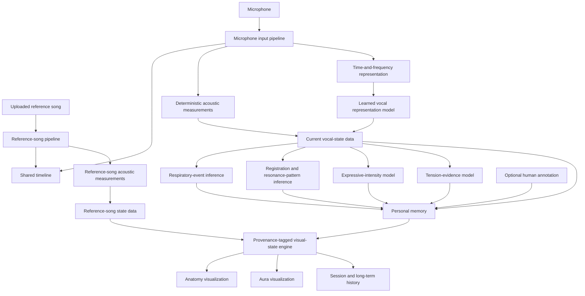
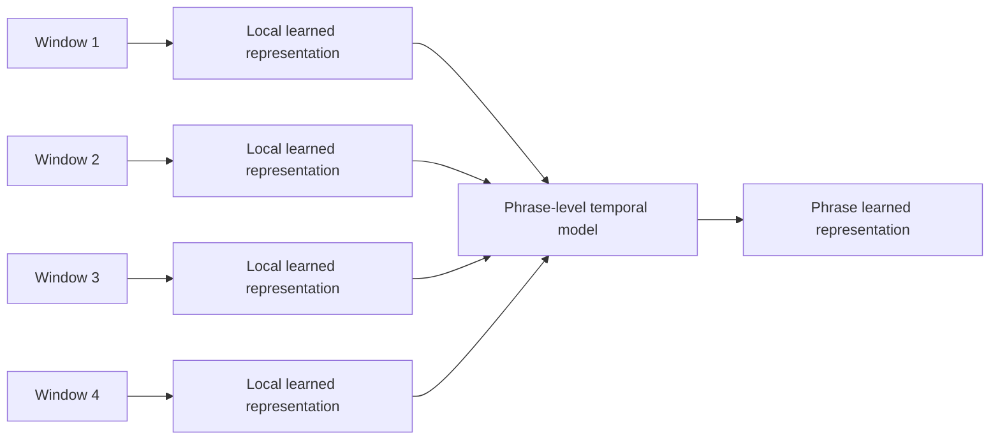
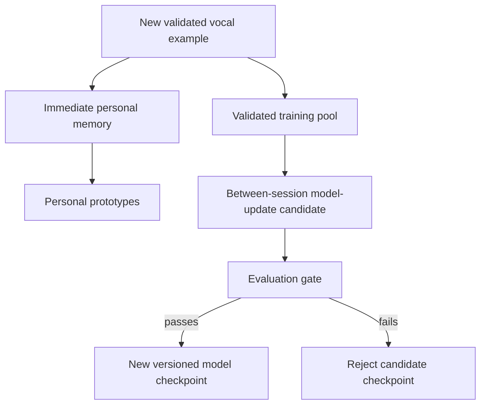
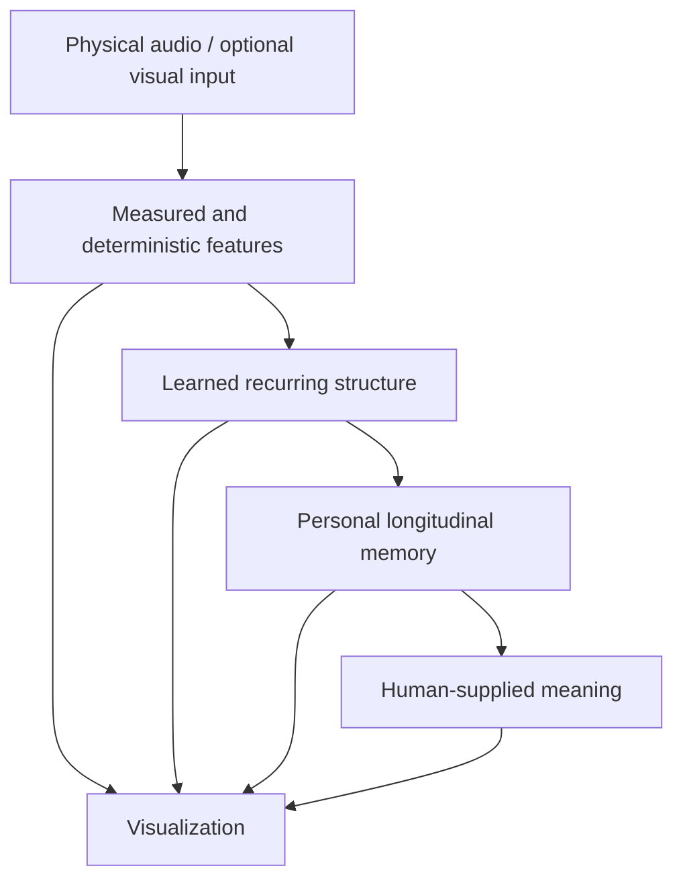

# Resonant Mirror v2
## Cursor-Ready Implementation Specification

**Document status:** Authoritative pre-implementation specification  
**Audience:** Cursor and human developers implementing Resonant Mirror v2  
**Primary principle:** Observe the singer before attempting to teach the singer.  
**Implementation posture:** Local-first, evidence-labeled, incremental, test-gated, and explicit about uncertainty.

---

## 0. Cursor execution directive

Treat this document as the product and engineering contract for Resonant Mirror v2.

Before changing code:

1. Read the repository `README.md`, existing architecture documents, verification scripts, and the current `vocal_resonance.html` / modular source implementation.
2. Map existing modules to the requirements in this document.
3. Preserve working legacy behavior unless a requirement below explicitly supersedes it.
4. Do not silently convert exploratory legacy physics or visualization heuristics into physiological facts.
5. Implement one numbered phase at a time.
6. Add or update tests for each phase before proceeding to the next.
7. Do not train or update model weights during a live singing session.
8. Do not make clinical, diagnostic, psychological-state, or wellness claims.
9. Do not output prescriptive vocal coaching in the initial Resonant Mirror v2 implementation. The initial product is an observing and reflecting system.
10. Every user-facing result must be traceable to one of the evidence classes defined in Section 3.
11. If a requirement cannot be implemented without making an unsupported scientific assumption, register it as an open assumption instead of inventing a value.
12. Keep all experimental thresholds configurable and explicitly labeled as provisional until validated.

Normative language:

- **MUST** = required for conformance.
- **MUST NOT** = prohibited.
- **SHOULD** = strong preference; deviation requires a documented reason.
- **MAY** = optional.
- **PROVISIONAL** = implementation starting point, not validated truth.
- **RESEARCH TARGET** = desired learned capability that must not be represented as already solved.

These words describe implementation obligations and design intent. They are **not claims that the current repository already has the capability**. A requirement becomes a demonstrated capability only after its implementation and specified validation gate pass.

## Plain-language rule

This document is technical because it is an implementation contract, but it MUST avoid unexplained specialist language. When a technical term is necessary, define it the first time it appears and prefer the ordinary-language description in user-facing text.

Canonical definitions used in this document:

- **fundamental frequency** — the repeating frequency that usually corresponds to the perceived musical pitch of a voiced sound;
- **formant** — a frequency region where the vocal tract strongly shapes or reinforces sound energy;
- **spectral envelope** — the broad shape of energy across frequencies, ignoring fine harmonic detail;
- **periodicity** — how consistently the waveform repeats;
- **harmonicity** — how strongly the signal follows a harmonic pattern rather than noise-like behavior;
- **learned representation / embedding** — a compact numeric vector produced by a model so acoustically or behaviorally related examples can be compared;
- **registration** — how vocal-fold and vocal-tract coordination changes across lower, transitional, mixed, and upper production patterns;
- **register transition** — the region where vocal production changes between lower- and upper-dominant coordination;
- **confidence** — the model's stated uncertainty about an inference; it is not proof that the inference is correct;
- **relative digital level** — signal level inside the digital recording system; without calibration it is not physical sound-pressure level in the room;
- **deterministic** — the same valid inputs and configuration produce the same semantic output rather than a learned or improvised guess;
- **classifier** — a model or rule set that assigns probabilities or labels to predefined categories;
- **provenance / evidence ancestry** — the traceable record of where a value came from, including source data, calculations, model version, and time;
- **calibration** — checking a measurement or probability against a trusted reference so its numerical meaning is known;
- **held-out evaluation** — testing on recordings, sessions, or singers that were deliberately excluded from training;
- **convolutional neural network** — a neural-network architecture commonly used to learn local patterns in images or time-and-frequency audio representations;
- **model inference** — applying a trained model to new input to produce an estimate without changing the model's weights;
- **model training** — adjusting model weights using labeled or otherwise structured training data;
- **fine-tuning** — additional model training on a narrower or more personal dataset after a more general model already exists;
- **model checkpoint** — a saved, versioned model state plus the metadata needed to reproduce or evaluate it;
- **personal prototype** — a representative summary of a group of the singer's prior examples, used for similarity comparison without retraining the neural network;
- **source separation** — estimating separate audio components, such as vocal and accompaniment, from one mixed recording;
- **latency** — time delay between an event occurring and the system receiving, analyzing, or displaying it;
- **root-mean-square amplitude** — a standard way to summarize signal amplitude over a short time window;
- **spectral centroid** — the weighted center of energy across frequency, often related to perceived brightness but not identical to it;
- **spectral rolloff** — a frequency below which a chosen fraction of the signal's spectral energy lies;
- **spectral tilt** — the overall tendency for energy to decrease or increase from lower to higher frequencies;
- **log-scaled mel-frequency spectrogram** — a time-and-frequency representation that uses a perceptually motivated frequency scale and compressed amplitude values for model input.

Legacy repository terms such as `phenomenological`, `morphism`, `homology`, or `neti_neti` MAY remain in archived or legacy modules when needed for compatibility, but v2 code, comments, interfaces, and user-facing copy SHOULD use direct engineering language unless the legacy term is being referenced by exact name.

---

# 1. Product definition

Resonant Mirror v2 is intended to become a personal vocal observation system. The target system combines:

- deterministic acoustic measurement;
- learned vocal representation;
- time-aligned analysis of the singer and an optional uploaded song;
- respiratory-event inference;
- resonance and registration analysis;
- phrase-level expressive-intensity analysis;
- personal memory across sessions;
- optional self-annotation;
- tension and coordination evidence;
- anatomical and aura visualization.

The target product is not intended to be a vocal-grade generator or a universal singing coach.

Its central questions are:

- What is the voice doing acoustically?
- How is the voice changing through time?
- What vocal states recur?
- How does this singer move between lower, mixed, and upper production patterns?
- Which states are becoming more reproducible?
- What does expressive intensity look like for this individual?
- What respiratory and support-related patterns accompany successful or comfortable phrases?
- When does probable strain or tension evidence increase?
- How does the singer's present production compare with their own previous productions?

The system SHOULD prefer self-relative descriptions over universal judgments.

Examples of desired output:

> Your sustained A4 has become more stable across the comparison sessions.

> This phrase is highly similar to examples you previously labeled “comfortable head voice.”

> The second phrase reached a similar expressive peak with less observed tension evidence.

Undesired output:

> Your voice is 87 out of 100.

> This is the correct voice.

> You are sad.

> Your diaphragm is definitely supporting correctly.

---

# 2. Non-negotiable product principles

## REQ-001 — Mirror before teacher

The initial implementation MUST observe and describe before it recommends.

The product MUST NOT automatically tell the singer what they “should” do based only on learned correlations.

Historical observations MAY be surfaced, for example:

> Across your last eight sessions, this timbre has become more reproducible.

Initial implementation MUST NOT convert that into:

> Therefore move your resonance upward next time.

Teaching can be a later, explicitly designed layer after the observation system has been validated.

## REQ-002 — Personal progress over universal scoring

The product MUST NOT collapse the singer into one universal “voice score.”

Progress SHOULD be defined through measurable or reproducible changes relative to the singer's own baseline and history.

Examples:

- pitch dispersion;
- stable range;
- phrase duration;
- repeatability;
- transition smoothness;
- vibrato consistency;
- resonance-pattern reproducibility;
- support-related coordination consistency;
- expressive-intensity trajectory control.

## REQ-003 — Measured and learned quantities remain distinct

A learned output MUST NOT overwrite or masquerade as a deterministic measurement.

For example:

- fundamental frequency is measured/derived;
- head-dominant production is inferred;
- “haunting” is human-perceptual;
- body movement shown without a sensor is simulated.

## REQ-004 — No internal-emotion inference

Resonant Mirror MAY be trained to estimate **human-perceived expressive intensity**, subject to the evaluation requirements in this document.

It MUST NOT claim to infer the singer's private emotional state from audio or video.

It MAY say:

> This passage was rated as more expressively intense.

It MUST NOT say:

> You are experiencing grief.

## REQ-005 — No clinical or medical claim

Resonant Mirror MUST NOT present itself as:

- a medical device;
- a diagnostic tool;
- a validated biofeedback device;
- a therapy;
- a wellness intervention;
- a detector of vocal pathology.

Tension, support, resonance, and respiratory outputs MUST be framed according to their evidence class and uncertainty.


---

# 2A. Canonical multidimensional Voice Profile

The long-term user model MUST remain multidimensional. It should be possible to inspect dimensions independently rather than deriving one master score.

## Pitch and range

Track, when sufficient data exists:

- total observed range;
- singer-labeled comfortable range;
- repeatedly stable range;
- note-specific stability;
- pitch accuracy relative to an optional target;
- pitch dispersion;
- register-specific range;
- range expansion or contraction over time.

## Production and registration

Track evidence for:

- chest-dominant production;
- head-dominant production;
- mixed coordination;
- clean production;
- distorted/textured production;
- breathy production;
- gritty/rough production;
- fry-like behavior;
- transition behavior.

## Timbre

Maintain deterministic acoustic descriptors and learned similarity rather than forcing one universal timbre taxonomy.

Optional human-facing axes retained from the design conversation include:

- bright ↔ dark;
- warm ↔ brilliant;
- thin ↔ full.

These axes MUST be treated as perceptual descriptors unless a specific acoustic definition is established.

## Texture

Optional perceptual/learned axes include:

- clean ↔ rough;
- breathy ↔ clear;
- smooth ↔ gritty;
- periodic ↔ noisy.

## Control

Track where defensible:

- sustained-note stability;
- vibrato rate, extent, and consistency;
- dynamic control;
- attacks;
- releases;
- transition repeatability;
- phrase repeatability.

Control MUST NOT be equated with artistic superiority. Intentional instability is allowed.

## Expression

Human-perceptual labels may include:

- intimate;
- raw;
- bright;
- haunting;
- restrained;
- aggressive;
- warm;
- powerful.

These MUST remain human-perceptual or learned-from-human-judgment fields, not physical measurements.


---

# 3. Evidence classification system

Every derived field, prediction, visualization, and user-facing statement MUST have an evidence class.

Use the following canonical classes.

| Class | Meaning | Examples |
|---|---|---|
| `measured` | Directly captured or calibrated sensor quantity | digital audio samples; calibrated sound-pressure level if calibration exists |
| `derived` | Deterministically calculated from measured data | fundamental frequency estimate; cents error; spectral centroid; relative digital level |
| `inferred` | Model- or heuristic-based probabilistic estimate | inhale event; head-dominant production; tension evidence |
| `personal_inference` | Inference grounded in this singer's stored history | similarity to previous comfortable mixed-voice examples |
| `human_labeled` | Meaning supplied by the singer, teacher, or listener | warm; raw; effortless; strained |
| `simulated` | Visual or physical model used to represent an idea, not a measurement | animated diaphragm motion without a sensor |
| `legacy_hypothesis` | Existing prototype rule retained for exploration but not promoted to truth | legacy whole-system resonance badge threshold |
| `unknown` | Insufficient evidence | uncertain register; unreliable formant estimate |

Existing repository fields such as `cited`, `pending`, and `phenomenological` for model parameters MAY remain, but v2 SHOULD add an independent `evidenceClass` so evidence provenance and user-facing truth status are not conflated. Here `phenomenological` is a legacy repository label meaning based on reported or designed experience rather than a direct body measurement.

## REQ-005A — Visual evidence and provenance contract

**The visualization layer may transform evidence; it may never create evidence.**

Every dynamic visual parameter MUST be traceable to one or more upstream measurements, deterministic calculations, human labels, or explicitly identified model inferences. The renderer MUST NOT invent a physiological or vocal state because a visual would look plausible.

Every visual-state record MUST include, directly or by reference:

- `value`;
- `evidenceClass`;
- source feature or source record identifiers;
- observation timestamp;
- confidence when the state is inferred;
- model version when a learned model produced the state;
- freshness / expiration information;
- quality flags.

A user or developer MUST be able to answer: **“Why is this visual active?”**

## REQ-005B — No generative renderer authority

A generative model MUST NOT directly control semantic visual state.

The semantic path MUST be:

```text
sensor evidence
    ↓
measured values
    ↓
deterministic derived values
    ↓
optional validated inference
    ↓
provenance-tagged visual state
    ↓
deterministic semantic renderer
```

Decorative animation MAY use controlled randomness, but decorative randomness MUST NOT change the meaning of the displayed state. In other words: **decorative rendering may vary; evidentiary meaning may not.**

## REQ-005C — Unknown, stale, and missing evidence

When evidence is absent, expired, corrupted, or below the configured reliability threshold:

- the semantic state MUST become `unknown`;
- an assertive anatomical or physiological visual MUST fade or turn neutral;
- stale values MUST NOT persist indefinitely;
- the renderer MUST NOT substitute a plausible guess.

Each real-time stream SHOULD define a maximum age appropriate to that feature. The exact expiration interval is PROVISIONAL and MUST be tested rather than assumed.

## REQ-005D — Visual replay audit

The system SHOULD support deterministic **semantic replay** from recorded analysis data.

Given the same:

- recorded evidence stream;
- feature-extraction version;
- model version;
- visual-state mapping version;

the same semantic visual states SHOULD be reproduced. Exact particle positions need not match unless explicitly seeded.

Replay failure means either the visual state is not sufficiently traceable or versioning is incomplete.

## REQ-005E — Developer provenance inspector

Development builds SHOULD provide an inspectable view for active visuals showing, where applicable:

- visual name;
- current value;
- evidence class;
- confidence;
- source measurements / derived values;
- model version;
- age of the evidence;
- whether the visual is measured, inferred, or simulated.

This inspector is a verification tool, not necessarily a permanent consumer-facing panel.

## Explicitly prohibited visual shortcuts

The following MUST NOT be implemented as evidence rules unless a later validation study independently establishes them for a defined context:

```text
low pitch → chest region automatically lights
high pitch → skull region automatically lights
louder signal → automatically means greater expressive intensity
distortion → automatically means stronger emotion
orange-red jaw glow → claim of measured jaw-muscle tension
probable inhale → claim of measured diaphragm displacement
mixed-voice inference → claim that the whole body is physically resonating
missing evidence → indefinitely continue the last physiological visual state
```

A teaching simulation MAY use simplified mappings only if it is clearly labeled `simulated` and is separated from observation mode.

---

# 4. Top-level architecture



The architecture MUST preserve two independent input streams until after feature extraction:

1. singer microphone stream;
2. uploaded reference-song stream.

They MUST NOT be mixed together before analysis.

---

# 5. Input modes

## REQ-006 — Microphone-only mode

The system MUST support live microphone analysis without an uploaded song.

## REQ-007 — Uploaded-song plus microphone mode

The system MUST support an uploaded song and microphone simultaneously.

The two streams MUST be:

- decoded independently;
- analyzed independently;
- timestamped against one shared logical clock;
- displayed as separate lanes;
- only compared after independent feature extraction.

## REQ-008 — Time alignment

Reference and user features MUST share a timestamp system.

A default dense analysis tick of approximately 20 milliseconds MAY be used as a starting point. This is PROVISIONAL and SHOULD remain configurable.

Algorithms MAY use longer internal windows while emitting results onto the shared timeline.

The acceptance criterion is that microphone and reference events can be compared within one configured timeline tick, subject to browser/device latency calibration.

## REQ-009 — Headphone leakage control

Uploaded-song comparison mode SHOULD use headphones, preferably with a microphone configuration that minimizes playback leakage into the microphone.

If the reference song is audibly leaking into the microphone:

- the system MUST NOT treat contaminated microphone features as clean singer-only evidence;
- leakage estimation is a RESEARCH TARGET; until validated, the system SHOULD rely on explicit headphone guidance and signal-quality warnings rather than claiming reliable automatic leakage detection;
- it MUST display a confidence warning;
- high-level learned comparisons MAY be disabled when leakage exceeds a configured confidence threshold.

The product SHOULD explicitly recommend headphones for reference-song comparison, but this recommendation is a signal-quality requirement, not vocal coaching.

## REQ-010 — No automatic song bundling

Benchmark songs MUST NOT be bundled into the application unless distribution rights are established.

The user may supply local audio.

---

# 6. Shared dense temporal representation

Resonant Mirror should treat the voice as multiple parallel data streams evolving through time.

```text
TIME ─────────────────────────────────────────────────────────────►

Fundamental frequency     ───────≈≈≈≈≈≈≈≈≈──────────────────────
Relative level            ───╭──────────────╮____________________
First formant             ─────╲______╭──────────────────────────
Second formant            ───────╲___________╭───────────────────
Spectral tilt             ─────────╮____╭────────────────────────
Periodicity               ─────██████████████▇▆──────────────────
Breath evidence           ─╮___________________________╭─────────
Registration evidence     chest ─ transition ─ mixed ─ head
Support evidence          ─────██████████████▇▆▅─────────────────
Tension evidence          ──▁▁▂▃▃▅▆▇█▇▅─────────────────────────
Expressive intensity      ──▁▂▃▄▅▆▇██▇▆▅▃───────────────────────
```

## REQ-011 — Shared dense feature timeline

All real-time and offline features SHOULD be representable on a common `VocalFrame` timeline.

A frame MUST include:

- timestamp;
- source identity;
- confidence;
- evidence class per feature or feature group;
- model version for learned fields;
- quality flags.

Dense streams MUST NOT imply that every feature has equal sampling reliability.

---

# 7. Deterministic acoustic engine

Machine learning MUST NOT be used merely to recreate quantities that can be robustly calculated.

The deterministic engine SHOULD include, subject to validation:

- fundamental frequency;
- note name;
- cents deviation from target when a target exists;
- spectral magnitude;
- spectral envelope;
- root-mean-square amplitude;
- relative digital level in decibels;
- harmonicity / harmonic-to-noise indicators;
- periodicity;
- spectral centroid;
- spectral rolloff;
- spectral tilt;
- note duration;
- onset timing;
- vibrato rate;
- vibrato extent;
- local dynamic range;
- attack and release shape;
- phrase timing.

## REQ-012 — Pitch

The application MUST derive pitch from an established pitch-estimation algorithm, not from the learned expressive model.

The existing repository stages two established pitch-estimation approaches—the method named YIN and the McLeod Pitch Method—as possible improvements over simple spectral peak picking. Cursor SHOULD inspect the existing audio design and validate the chosen approach rather than assuming either method is automatically best for this product.

The user-facing pitch display SHOULD be traceable:

> A4 · 438.9 hertz · approximately four cents flat

## REQ-013 — Pitch error

When a target frequency exists:

`centsError = 1200 × log2(measuredFrequency / targetFrequency)`

This value MUST remain deterministic.

## REQ-014 — Piano, metronome, playback, and timing

The following MUST remain deterministic:

- piano synthesis or sample playback;
- metronome;
- song playback;
- note matching;
- beat timing;
- frequency-to-color mapping;
- animation state transitions;
- basic session statistics.

---

# 8. Dense sound-level / decibel requirement

The user's requirement that decibel behavior be a dense expressive data point is retained, with one scientific correction.

## REQ-015 — Default level unit

An ordinary uncalibrated consumer microphone generally does **not** provide trustworthy physical sound-pressure level in decibels.

Therefore the default dense level signal MUST be stored as a relative digital quantity, such as:

- root-mean-square amplitude;
- decibels relative to full scale.

Only a calibrated microphone path MAY expose estimated sound-pressure level in decibels.

The interface MUST label the units accurately.

## REQ-016 — Dense level trajectory

The system MUST preserve the time trajectory, not only phrase averages.

For each phrase it SHOULD derive:

- mean;
- median;
- minimum;
- maximum;
- dynamic range;
- variance;
- rate of increase;
- rate of decrease;
- attack steepness;
- time near peak;
- build duration;
- release duration;
- local fluctuations;
- phrase-to-phrase contrast.

Two phrases with the same average level MUST be allowed to have different expressive contours.

## REQ-017 — Level is not emotion

The model MUST NOT learn or encode the rule:

`higher level = more emotion`

Level is one dense acoustic variable among many.

The expressive-intensity training design SHOULD test relationships among:

- level trajectory;
- pitch trajectory;
- resonance behavior;
- spectral change;
- texture;
- register;
- phrase history;
- human comparisons.

---

# 9. Resonance analysis

Resonance MUST be included, but the word “resonance” must not be allowed to collapse several different concepts.

## 9.1 Observable acoustic resonance evidence

Microphone audio can contain acoustic evidence related to vocal-tract filtering, including:

- spectral envelope;
- formant estimates;
- formant bandwidth estimates;
- harmonic energy distribution;
- spectral tilt;
- spectral centroid;
- spectral peaks;
- harmonic-to-noise relationships;
- movement of these quantities through time.

## REQ-018 — Formant trajectories

Where reliable, the system SHOULD estimate at least the first three vocal-tract formants and their trajectories.

Higher formants MAY be explored where reliable.

Every formant estimate MUST carry a quality/confidence field.

At high fundamental frequencies, formant estimation can become unreliable because harmonics sparsely sample the vocal-tract envelope. The system MUST allow `unknown` rather than displaying false precision.

## REQ-019 — Pitch and resonance remain distinct

Fundamental frequency describes vocal-fold oscillation rate.

Formants and the spectral envelope describe filtering/resonant properties of the vocal tract.

Two performances of the same note MAY have different resonance/timbre patterns.

## REQ-020 — Resonance is a trajectory

The system SHOULD analyze how resonance-related features move during:

- vowel changes;
- dynamic changes;
- register transitions;
- phrase builds;
- releases;
- repeated takes.

Static “good resonance” scoring is prohibited.

---

# 10. Chest, head, mixed, and resonance-region behavior

The user wants Resonant Mirror to observe chest voice, head voice, mixed voice, movement between regions, and moments where the production feels like “the whole system is resonating.”

This requirement must be implemented without treating subjective placement sensations as literal cavity measurements.

## REQ-021 — Registration terminology

Use standard vocal terminology:

- chest-dominant production;
- head-dominant production;
- mixed coordination;
- register-transition behavior;
- clean, breathy, gritty, distorted, fry-like production where supported.

Do not use invented anatomical-spiritual zone labels as acoustic facts.

## REQ-022 — Resonance-region visualization is a mapping

A chest-region glow or skull-rim glow MAY represent an inferred/acoustically correlated production pattern.

It MUST NOT be described as proof that the chest or skull cavity itself is the sole resonator producing that register.

The interface MUST classify this mapping as `inferred` or `simulated`.

## REQ-023 — Head-voice skull-rim visualization

When upper/head-dominant resonance evidence rises, the anatomy MAY visualize a subtle rim or field around the skull/head region.

This is a visual metaphor grounded in inferred production evidence, not a measurement that sound “enters” or “comes from” the top of the skull.

## REQ-024 — Mixed coordination

Mixed voice SHOULD be treated as a coordination/transition pattern, not a magical third cavity.

The system SHOULD treat learning and comparing trajectories between lower/chest-dominant and upper/head-dominant production as a RESEARCH TARGET. Until validated, such outputs MUST remain inferred and uncertainty-aware.

## REQ-025 — Transition / “throwing” behavior

The system SHOULD treat estimation of the following transition shapes as a RESEARCH TARGET:

- smooth redistribution;
- abrupt register jump;
- probable forced upward carry;
- overshoot;
- instability immediately after transition;
- repeated compensation;
- smooth mixed bridge.

The label “forced” MUST remain probabilistic unless supported by human or expert annotation.

Conceptual contrast:

```text
SMOOTH
chest ───────── transition ───────── mixed ───────── head

ABRUPT / POSSIBLY FORCED
chest ───── push-like change ─ jump ─ instability ─ compensation
```

## REQ-026 — “Whole-system resonance” v2 meaning

The legacy prototype contains an arithmetic `WHOLE-SYSTEM RESONANCE` badge.

That legacy threshold MUST NOT be treated as validated whole-body resonance.

In v2, “whole-system” SHOULD mean a **research target for integrated coordination**, potentially involving:

- stable pitch where intended;
- coherent resonance trajectory;
- controlled level trajectory;
- stable periodicity;
- smooth registration transition;
- support-related evidence;
- low or decreasing strain evidence;
- repeatability;
- singer-reported comfort, freedom, connectedness, or ease.

No single hard-coded threshold should be promoted to truth.

---

# 11. Respiration: inhale and exhale learning

Respiratory-event classification is a RESEARCH TARGET. The system SHOULD estimate temporal respiratory states from microphone evidence rather than relying only on one hard-coded breath rule, and it MUST retain an `unknown` state.

## REQ-027 — Respiratory event classes

Initial classes MAY include:

- inhale;
- probable post-inhale pause / preparation;
- phonated exhalation;
- unphonated exhalation;
- phrase-ending release;
- uncertain.

Not all classes will be reliably recoverable from microphone audio alone.

## REQ-028 — Respiratory trajectory

The model SHOULD study:

`inhale → onset → phonated exhalation → phrase development → release → next inhale`

rather than isolated inhale events only.

## REQ-029 — Audio-only limitations

The system MUST NOT claim it directly measures lung airflow direction or diaphragm motion from microphone audio.

It MAY estimate respiratory events from acoustic evidence when a validated detector is available.

If future dedicated sensors exist, their measurements can become a separate `measured` stream.

## REQ-029A — Breath sensing acquisition strategy

Do **not** assume that the operating system, browser, or phone supplies a validated `inhale_started` / `exhale_started` event. The initial architecture MUST treat platform interfaces as **audio-capture and audio-analysis infrastructure**, while Resonant Mirror supplies its own respiratory-event logic.

### Browser / current v2 path

Use the browser's standard microphone-capture interface (`navigator.mediaDevices.getUserMedia`) to obtain the local audio stream after user permission. The browser supplies audio; it does not establish that a frame is inhale or exhale.

Preferred v2 path:

```text
browser microphone stream
        ↓
dense acoustic features
        ↓
small respiratory-event classifier
        ↓
temporal smoothing / state logic
        ↓
inhale | phonated exhale | unphonated exhale | pause | unknown
```

The respiratory detector SHOULD run locally. A third-party cloud service MUST NOT be required for the initial implementation.

### Future Apple-native path

Apple's audio engine can capture microphone buffers, and the Sound Analysis framework can run sound-classification requests over an audio stream, including a custom Core ML sound-classification model. This makes it a plausible future host for a Resonant Mirror respiratory classifier; it does **not** provide validated inhale/exhale labels by itself.

Before native implementation, verify the current Apple documentation for `AVAudioEngine`, `SNAudioStreamAnalyzer`, and `SNClassifySoundRequest`; platform interfaces can change.

### Future Android-native path

Android provides microphone recording through its audio-recording interfaces. Where a device supports it, the `UNPROCESSED` microphone source can request less-processed audio; Android documentation states that it falls back when unavailable. This MAY be useful for subtle breath sounds, but it MUST be tested device by device and MUST NOT be assumed to be raw, calibrated, or identical across hardware.

Before native implementation, verify the current Android documentation for `AudioRecord` / `MediaRecorder.AudioSource`.

Official implementation references to re-check at implementation time:

- World Wide Web Consortium, **Media Capture and Streams**: `https://www.w3.org/TR/mediacapture-streams/`
- Apple, **Classifying Sounds in an Audio Stream**: `https://developer.apple.com/documentation/soundanalysis/classifying-sounds-in-an-audio-stream`
- Apple, **SNClassifySoundRequest**: `https://developer.apple.com/documentation/soundanalysis/snclassifysoundrequest`
- Android, **MediaRecorder.AudioSource**: `https://developer.android.com/reference/android/media/MediaRecorder.AudioSource`

These references document capture and classification infrastructure. They are not evidence that a platform contains a built-in validated breath-phase detector.

### Optional respiratory-rate health data

Apple HealthKit and Android Health Connect can store respiratory-rate records. Those records describe a rate such as breaths per minute; they do **not** identify the start and end of each inhale and exhale. If a future native Resonant Mirror version reads those records with user permission, they MAY be used as contextual or validation data, but MUST NOT drive real-time inhale/exhale animation as though they were breath-phase events.

Official references to re-check at implementation time:

- Apple HealthKit respiratory rate: `https://developer.apple.com/documentation/healthkit/hkquantitytypeidentifier/respiratoryrate`
- Android Health Connect `RespiratoryRateRecord`: `https://developer.android.com/reference/androidx/health/connect/client/records/RespiratoryRateRecord`

## REQ-029B — Respiratory classifier scope

The first classifier SHOULD distinguish only states for which sufficient labeled data exists. A practical starting set is:

- inhale;
- phonated exhale (singing or voicing during outgoing breath);
- unphonated exhale;
- pause / breath hold / preparation;
- other / uncertain.

Do not force every frame into inhale or exhale.

The classifier SHOULD use short overlapping audio windows, but window length and overlap are PROVISIONAL research parameters. Do not hard-code a value merely because an example used 500 milliseconds.

## REQ-029C — Respiratory temporal state logic

Frame-level predictions SHOULD be converted into events using deterministic temporal rules or a separately validated temporal model. The implementation MUST avoid rapid frame-to-frame flicker.

Event records SHOULD include:

- event class;
- estimated start;
- estimated end;
- confidence;
- evidence class;
- model version;
- source stream;
- quality flags.

## REQ-029D — Respiratory validation corpus

Before breath events become an assertive user-facing visual, validation data SHOULD include variation in:

- microphone distance;
- microphone/device type;
- room noise;
- oral and nasal inhalation;
- quiet and stronger exhalation;
- phonated exhalation;
- breathy singing.

Negative examples SHOULD include:

- speech;
- ordinary singing without a distinct breath event;
- sniffing;
- coughing;
- sighing;
- mouth clicks;
- clothing movement;
- room noise;
- reference-song leakage.

The test report SHOULD state at minimum:

- missed inhale events;
- false inhale events;
- missed exhale events;
- false exhale events;
- typical event-boundary timing error;
- performance under different microphone distances and noise levels.

Do not present breath-phase confidence percentages to users until the detector has been evaluated on held-out sessions and, for a general model, held-out singers.

## REQ-029E — Far-field respiration is out of initial scope

Quiet sleeping respiration recorded from a phone several feet away MUST be treated as a separate sensing condition from singing-practice respiration near a microphone. Resonant Mirror v2 MUST NOT claim bedside-distance breath-phase capability unless that condition is separately implemented and validated.

The initial target is the microphone geometry actually used during vocal practice.

## REQ-030 — Reference-song respiration

When analyzing an uploaded song, probable respiratory events MAY be estimated on the reference track.

Reference breath predictions MUST remain separate from the user's breath predictions.

The interface MAY show two time-aligned breath lanes:

- reference performance;
- current singer.

The system MUST NOT require the singer to copy the reference singer's breathing exactly.

---

# 12. Supported voice as a learned coordination shape

“Supported voice” MUST NOT be implemented as a single acoustic rule or a binary physiological truth.

## REQ-031 — Support-related coordination

Use the term **support-related coordination evidence**.

Potential evidence includes:

- phrase-level level stability where intended;
- controlled dynamic change;
- periodic stability;
- pitch stability;
- harmonic continuity;
- onset/release behavior;
- phrase duration;
- end-of-phrase degradation;
- respiratory-event timing;
- repeatability;
- user-reported comfort or effort.

## REQ-032 — Personal support prototype

The personal memory system SHOULD allow the singer to label takes with terms such as:

- supported;
- comfortable;
- effortless;
- running out of breath;
- pressed;
- strained;
- unstable.

These labels MAY form personal prototypes.

A valid future output:

> The final third of this phrase increasingly resembles takes you previously labeled “running out of breath.”

Invalid output:

> Your diaphragm stopped supporting at 3.2 seconds.

## REQ-033 — General plus personal support model

A general model MAY be trained from expert-annotated examples.

Personal history SHOULD ultimately carry substantial weight because support-related acoustic manifestations vary across singers and contexts.

---

# 13. Tension and coordination evidence

The system SHOULD investigate learned shapes of a tense body, face, jaw, neck, and voice, while never overclaiming certainty.

## REQ-034 — Audio tension evidence

Audio-only tension evidence MAY draw from patterns such as:

- pressed or abrupt onset;
- reduced periodic stability;
- unstable vibrato;
- harsh spectral change;
- abrupt dynamic change;
- transition instability;
- resonance-pattern collapse;
- shortening phrase capacity;
- deterioration near phrase end.

These are candidate correlates, not proof of muscle tension.

## REQ-035 — Optional camera-based tension evidence

A future or optional video path MAY estimate visible cues such as:

- jaw rigidity;
- excessive jaw displacement;
- facial strain;
- neck engagement;
- chin lift;
- shoulder lift;
- posture compression.

Camera use MUST be opt-in.

Raw video SHOULD remain local and SHOULD NOT be stored by default.

Derived landmarks/features SHOULD be retained only with explicit user consent.

## REQ-036 — Self-reported tension

The singer SHOULD be able to label:

- jaw tight;
- throat tight;
- neck engaged;
- shoulders lifted;
- pressed;
- free;
- comfortable.

Self-reported sensation is `human_labeled`, not objective ground truth, but it is highly valuable for personal calibration.

## REQ-037 — Graded tension, not binary

Tension MUST NOT be represented merely as `tense / not tense`.

Use graded evidence and confidence, potentially by region:

- jaw;
- face;
- throat / neck;
- upper torso;
- global effort.

## REQ-038 — Orange-red tension visualization

The user's tension visualization requirement is mandatory:

- low evidence: dim warm orange;
- increasing evidence: stronger orange;
- high evidence: denser orange-red.

The visual intensity MUST represent **estimated tension/strain evidence and confidence**, not a calibrated amount of physiological tension.

Localized evidence SHOULD create localized glow.

The interface MUST contain accessible non-color cues because color alone is insufficient.

---

# 14. Realistic anatomy visualization

The anatomy should become more realistic than the legacy silhouette while remaining honest about what is measured.

## REQ-039 — Required anatomical structures

The v2 anatomy view SHOULD include at minimum:

- skull;
- jaw;
- oral cavity;
- nasal cavity;
- pharyngeal region;
- laryngeal region;
- neck;
- rib cage;
- lungs;
- diaphragm;
- sternum;
- xiphoid process;
- upper torso.

Additional structures MAY be added when they improve comprehension.

## REQ-040 — Transparency mode

The interface MUST support a resonance-transparent anatomy mode in which internal visual layers can be seen through the body.

## REQ-041 — Actual pitch layer

The interface MUST support an “actual pitch” layer displaying the measured/derived current pitch independently of the resonance visualization.

## REQ-042 — Breathing anatomy

Diaphragm, rib, and torso motion MAY animate with inferred respiratory state.

Unless a sensor measures those structures, the motion MUST be labeled `simulated`.

## REQ-043 — Airflow

Airflow particles MAY show inferred inhale/exhale direction.

They MUST NOT be presented as measured airflow velocity.

---

# 15. Aura semantics

The aura is not a score.

Two distinct dimensions MUST remain separate.

## REQ-044 — Technical alignment

Technical alignment MAY include:

- pitch-target alignment;
- rhythm alignment;
- selected-exercise alignment;
- sustained stability.

## REQ-045 — Expressive intensity

Expressive intensity is a separate learned/human-perceptual dimension.

## REQ-046 — Visual separation

Suggested mapping:

- aura coherence / persistence → sustained continuity or target alignment;
- aura energy / motion → expressive intensity;
- orange-red localized overlay → tension/strain evidence.

A technically controlled quiet passage may create a stable delicate field.

A climactic scream may create an energetic field.

Neither is inherently better.

## REQ-047 — Persistence, not judgment

The aura MUST represent persistence/continuity of a state rather than a reward signal implying that maximum brightness is “best.”

---

# 16. Learned vocal representation

The main initial machine-learning RESEARCH TARGET is a **Vocal Representation Model**, not merely a technique classifier. This names the model we intend to test; it does not assert that the representation is already useful.

## REQ-048 — Input representation

Initial model path:

`audio → log-scaled mel-frequency spectrogram → small convolutional neural network → learned embedding`

Initial embedding dimensionality:

**64 dimensions, PROVISIONAL.**

Initial local audio window:

**approximately 0.5 to 2 seconds, PROVISIONAL.**

## REQ-049 — Small first model

The first learned model SHOULD be small enough to understand, train, debug, and inspect.

The original working target of “a few hundred thousand parameters” MAY be used as a rough scale, not a hard requirement.

Do not begin with:

- giant raw-waveform transformers;
- unnecessarily large foundation audio models;
- complex distributed training.

## REQ-050 — Shared representation and auxiliary tasks

The embedding MAY support small task heads for:

- expressive-intensity ranking;
- clean versus textured/distorted production;
- breathiness;
- gritty/rough texture;
- head/chest/mixed candidates;
- respiratory-event classification;
- personal similarity.

The network does not need every head in the first model.

## REQ-051 — Interpretable features remain parallel

The learned representation MUST NOT replace the deterministic feature vector.

Each relevant time window SHOULD retain both.


## REQ-051A — Keep the first PyTorch training loop explicit

Because this is intended to be a serious first PyTorch implementation rather than a opaque automated model-building pipeline, the training code SHOULD expose the core lifecycle clearly:

- dataset construction;
- batching;
- tensors;
- model modules;
- forward pass;
- loss calculation;
- backpropagation;
- optimizer step;
- training/validation/test separation;
- checkpoint save/load;
- inference.

Do not bury the first model behind a high-level training framework that makes these mechanics opaque unless there is a documented reason.


---

# 17. Phrase-level temporal model

Expressive vocal behavior is not fully captured by isolated windows.

## REQ-052 — Two temporal scales

Use:

1. local-window representation;
2. phrase-level representation.



## REQ-053 — Phrase trajectory

The phrase model SHOULD eventually capture trajectories such as:

`restrained → building → tension → peak → release`

Potential outputs:

- build shape;
- peak timing;
- release shape;
- transition smoothness;
- trajectory similarity;
- control at comparable intensity.

---

# 18. Human-perceived expressive intensity

The RESEARCH TARGET is **human-perceived expressive intensity**, not “emotion” as a hidden mental state. Whether the model learns a useful and generalizable intensity signal must be established by evaluation.

## REQ-054 — Pairwise annotation

Prefer pairwise human judgments:

> Which passage has greater vocal expressive intensity?

over artificial absolute scales such as “73 percent emotional.”

Pairwise examples MAY be used to train a ranking model; whether the ranking generalizes is an evaluation question.

## REQ-055 — Within-performance comparisons

Within-performance comparisons SHOULD be prioritized because they keep many potentially misleading factors relatively constant:

- singer identity;
- venue;
- microphone;
- recording era;
- general timbre.

The useful signal is how the performance changes within itself.

## REQ-056 — Diverse intensity mechanisms

Training data MUST include different ways of producing expressive intensity.

The model MUST NOT be encouraged to equate intensity with:

- loudness;
- distortion;
- high pitch;
- crowd noise;
- concert reverberation;
- one genre;
- one singer.

## REQ-057 — Counterexamples

Dataset design SHOULD deliberately include:

- intense studio vocals;
- restrained live vocals;
- quiet intense passages;
- loud restrained passages;
- clean intense vocals;
- distorted low-intensity vocals;
- high-pitched restrained examples;
- low-pitched intense examples;
- varied voices;
- varied recording conditions.

## REQ-058 — Famous-performance trap

Legendary live performances MAY be useful research examples, but MUST NOT simply be labeled “high intensity.”

The model must be protected from shortcuts such as:

- crowd noise;
- reverberation;
- microphone saturation;
- backing-instrument density;
- singer identity.

## REQ-059 — Human disagreement

Annotator disagreement MUST be preserved.

The dataset SHOULD store:

- each vote;
- aggregate preference;
- confidence;
- disagreement rate.

Do not manufacture a false single ground-truth score where humans disagree.


## REQ-059A — General and personal expressive intensity

Keep two conceptual levels separate:

- **general perceived intensity:** learned across many singers;
- **personal perceived intensity:** calibrated to the individual singer's history and labels.

They do not have to be separate neural networks, but their evidence sources MUST be distinguishable.

The design conversation used artists such as Kurt Cobain and Michael Jackson only to illustrate a research hypothesis: listeners may perceive high intensity through different vocal patterns. Do not encode artist-specific technique claims as ground truth. The implementation requirement is to include diverse styles and counterexamples so the model is not rewarded for one narrow intensity pattern.


---

# 19. Uploaded songs and vocal source separation

## REQ-060 — Full-mix limitation

A full musical mix contaminates vocal-specific measurements.

The system MUST distinguish:

- reference features that are valid on the full mix;
- reference vocal features that require vocal isolation.

## REQ-061 — Source separation is separate subsystem

Machine-learning vocal source separation MAY be introduced later:

`full mix → vocal stem + instrumental stem`

It must not be confused with the personal Vocal Representation Model.

## REQ-062 — Reference confidence

If the reference vocal cannot be isolated reliably, resonance, breath, and vocal texture predictions for the reference song MUST show reduced confidence or be disabled.

---

# 20. Personal memory and personalization

Resonant Mirror needs two different forms of learning.



## REQ-063 — Fast personal memory

New embeddings MAY be stored immediately without changing model weights.

The personal space may contain regions such as:

- comfortable head voice;
- stable chest-dominant production;
- preferred mixed coordination;
- grit;
- soft production;
- loud production;
- stable sustained notes;
- expressive peaks.

## REQ-064 — Personal prototypes

The singer SHOULD be able to define, rename, merge, split, and delete personal prototypes.

Examples:

- comfortable head voice;
- preferred grit;
- effortless mixed voice;
- stable A4;
- intimate soft tone.

## REQ-065 — Slow model learning

Actual weight updates MUST happen between sessions, not while the singer is performing.

The original ideas “every five sessions” or “after one hundred validated samples” are only PROVISIONAL examples.

The trigger must remain configurable and eventually evidence-based.

## REQ-066 — No implicit behavioral weight training

The legacy repository contains a “no weight training on user behavior” discipline.

Reconcile that with v2 personalization as follows:

- raw user behavior MUST NOT silently alter weights;
- only explicitly retained and sufficiently validated examples MAY enter a personal training dataset;
- training must be opt-in;
- training must occur between sessions;
- candidate checkpoints must pass evaluation before activation.

## REQ-067 — Model versioning

Every learned inference MUST record:

- model identifier;
- model version;
- training-data version where available.

Every session MUST record which model version generated its embeddings.

## REQ-068 — Historical embedding compatibility

Before changing the embedding model, implement one of:

- re-embed retained historical audio;
- preserve per-version embedding spaces;
- freeze the encoder and update only downstream heads;
- validated alignment between embedding versions.

Do not compare incompatible embeddings as if they occupy one stable space.

---

# 21. Human self-annotation

After a take or session, the product SHOULD optionally ask:

> How did this production feel or sound to you?

Suggested descriptors retained from the design conversation:

- warm;
- bright;
- raw;
- breathy;
- powerful;
- restrained;
- intimate;
- gritty;
- clear;
- effortless;
- comfortable;
- supported;
- strained;
- pressed;
- jaw tight;
- throat tight;
- running out of breath.

## REQ-069 — Editable meaning

User labels MUST remain editable.

The singer MAY later rename or reinterpret a personal state.

Machine learning must not freeze subjective meaning into permanent “truth.”

---

# 22. Progress and long-term analysis

Resonant Mirror operates on two explicitly different timescales:

- **seconds:** current continuity, current alignment, current respiratory/registration/tension/intensity state;
- **sessions:** long-term development, repeatability, range changes, prototype evolution, and personal trajectories.

These timescales MUST NOT be collapsed into one score.

## REQ-070 — Self-relative progress

A progress claim MUST specify:

- what changed;
- compared with what;
- over what period;
- which measurement or inference supports it.

Example retained from the design:

- typical A4 pitch dispersion changes from approximately ±31 cents to ±12 cents.

Other examples:

> Your stable head-voice region expanded upward by three semitones over six weeks.

> This timbre became more reproducible across your last eight sessions.

## REQ-071 — Repeatability

Repeatability is a first-class long-term metric.

A one-time state and a reproducible state must be distinguishable.

## REQ-072 — No “better voice” claim

Do not convert a multidimensional improvement into a universal quality score.

---

# 23. Data model

The implementation SHOULD define explicit schema objects.

## 23.1 Session

```json
{
  "sessionId": "string",
  "startedAt": "timestamp",
  "endedAt": "timestamp|null",
  "modelVersions": {},
  "inputMode": "microphone|microphone_plus_reference",
  "referenceTrackId": "string|null",
  "calibration": {},
  "userConsent": {},
  "notes": []
}
```

## 23.2 Vocal frame

```json
{
  "timestampSeconds": 0.0,
  "source": "user|reference",
  "features": {
    "fundamentalFrequencyHertz": null,
    "pitchConfidence": 0.0,
    "relativeLevelDecibelsFullScale": null,
    "spectralCentroidHertz": null,
    "spectralTilt": null,
    "periodicity": null,
    "formantsHertz": [],
    "formantConfidence": []
  },
  "inferences": {
    "respiration": {},
    "registration": {},
    "supportEvidence": {},
    "tensionEvidence": {},
    "expressiveIntensity": {}
  },
  "qualityFlags": [],
  "modelVersion": null,
  "provenanceByField": {
    "features.fundamentalFrequencyHertz": {
      "evidenceClass": "derived",
      "sourceIds": [],
      "algorithmVersion": "string|null",
      "modelVersion": null,
      "confidence": null,
      "observedAtSeconds": 0.0,
      "expiresAtSeconds": null
    }
  }
}
```

`provenanceByField` MAY be stored in a normalized table rather than duplicated inline. The requirement is traceability, not this exact storage shape.

## 23.3 Phrase

```json
{
  "phraseId": "string",
  "sessionId": "string",
  "source": "user|reference",
  "startSeconds": 0.0,
  "endSeconds": 0.0,
  "frameRange": [],
  "embeddingVersion": "string|null",
  "phraseEmbedding": [],
  "trajectoryFeatures": {},
  "humanLabels": []
}
```

## 23.4 Personal prototype

```json
{
  "prototypeId": "string",
  "name": "comfortable head voice",
  "exampleIds": [],
  "embeddingVersion": "string",
  "centroid": [],
  "dispersion": {},
  "userConfidence": null,
  "createdAt": "timestamp",
  "updatedAt": "timestamp"
}
```

## 23.5 Visual-state record

```json
{
  "visualStateId": "string",
  "timestampSeconds": 0.0,
  "visualName": "jawTensionGlow",
  "value": 0.0,
  "evidenceClass": "inferred",
  "confidence": 0.0,
  "sourceFieldPaths": [],
  "modelVersion": "string|null",
  "mappingVersion": "string",
  "observedAtSeconds": 0.0,
  "expiresAtSeconds": 0.0,
  "qualityFlags": []
}
```

A visual-state record MUST NOT claim more than its evidence class supports. For example, `jawTensionGlow` represents tension evidence, not measured jaw-muscle force.

## REQ-073 — Provenance

Every stored feature or inference SHOULD be traceable to:

- source recording;
- timestamp or time range;
- algorithm/model;
- version;
- evidence class.

---

# 24. Data retention and privacy

## REQ-074 — Local-first

The eventual architecture SHOULD favor:

- local microphone capture;
- local feature extraction;
- local inference where feasible;
- local personal embeddings;
- local personal history;
- local personal fine-tuning where feasible.

Research training on the developer machine is acceptable during development.


The existing repository uses a local offline SQLite pipeline for aggregate/session analysis. Cursor SHOULD preserve compatibility with that pipeline during v2 migration unless a replacement is explicitly justified and tested.


## REQ-075 — Raw audio sensitivity

Raw voice recordings must be treated as high-sensitivity personal data.

The product MUST define retention separately for:

- raw audio;
- deterministic acoustic features;
- learned embeddings;
- human labels;
- session history;
- optional video.

## REQ-076 — No remote transfer by default

Raw audio and video SHOULD NOT be uploaded automatically.

Any remote processing path must be explicit and opt-in.

## REQ-077 — Deletion

The design MUST permit deletion of:

- recording;
- session;
- labels;
- personal prototypes;
- long-term personal history.

If personal model weights were trained from deleted data, the product must have a documented policy for retraining or explaining residual model influence before claiming deletion is complete.


## REQ-077A — Append-only experiment provenance

For model-development and product-study logs, preserve append-only provenance of:

- which session/example was included;
- which label/version existed at training time;
- which checkpoint was produced;
- which evaluation was run.

User-facing objects may be editable or deletable, but research history must not silently rewrite itself.

Where product-level behavioral experiments are introduced, preserve a holdout/control design rather than closing a feedback loop on all users simultaneously.


---

# 25. Training data and licensing

Commercial live recordings raise a separate rights issue.

## REQ-078 — Training-rights gate

Before production training on commercial recordings, establish rights for:

- model training;
- storage;
- derived stems;
- annotation;
- distribution of resulting checkpoints.

Prefer:

- explicitly licensed recordings;
- commissioned recordings;
- opt-in singers;
- material with clear training rights.

Benchmarking with locally supplied audio does not imply the right to redistribute or train a production model on that audio.

---

# 26. Evaluation design

## REQ-079 — Entire-session holdout

Never randomly distribute neighboring windows from one recording across training and validation.

Early personal experiment example:

```text
Sessions 1–8  → training
Session 9     → validation
Session 10    → test
```

The exact counts are illustrative; the grouping rule is mandatory.

## REQ-080 — Speaker-held-out evaluation

When multiple singers exist, the general model MUST be evaluated on singers not present in training.

## REQ-081 — Tests for shortcut learning and misleading correlations

Evaluate whether the model has learned:

- singer identity;
- microphone identity;
- room;
- venue;
- crowd;
- loudness;
- pitch height;
- distortion;
- genre;
- backing-track density;

instead of the target behavior.

## REQ-082 — Representation diagnostics

Project embeddings into two dimensions for research visualization and ask:

- Are singers clustering mainly by identity?
- Does register dominate?
- Does distortion dominate?
- Do intensity levels separate?
- Are multiple intensity mechanisms represented?
- Do personal states form stable clusters?
- Are phrase trajectories reproducible?

If a model mostly encodes singer identity rather than the intended target, that is a research result to report, not a failure to hide.

## REQ-083 — Uncertainty

Learned outputs MUST support uncertainty and an unknown state.

Do not force every frame into chest, mixed, head, tense, supported, or intense.

## REQ-084 — Calibration

Probabilistic outputs SHOULD be evaluated for calibration before user-facing confidence percentages are presented.

---

# 27. Benchmark protocol

The initial functional benchmarks are:

1. **Smells Like Teen Spirit**
2. **Earth Song**

These are benchmark references, not bundled assets and not automatic training data.

## REQ-085 — Benchmark goals

For each benchmark, test whether the implemented pipeline successfully displays and time-aligns:

- user pitch;
- reference pitch where recoverable;
- user level trajectory;
- reference level trajectory;
- resonance-related trajectories;
- probable respiration events;
- registration transition candidates;
- expressive-intensity contour;
- tension evidence for the user;
- support-related evidence for the user.

## REQ-086 — Benchmark scientific caution

Do not import old unsupported vocal claims about the artists as ground truth.

The benchmark asks whether the system works technically on musically demanding material, not whether prior descriptions of a singer's anatomy are correct.

---

# 28. Interface layers and controls

The user should be able to toggle layers rather than seeing all information at once.

Required or planned layers:

- realistic anatomy;
- transparent anatomy;
- actual pitch;
- resonance / spectral behavior;
- respiratory state / airflow;
- registration transition;
- support-related evidence;
- tension evidence;
- aura;
- reference-song lane;
- current singer lane;
- long-term personal history;
- optional piano;
- optional metronome.

## REQ-087 — Measured / inferred / simulated legend

The interface MUST provide a compact legend or inspectable metadata showing whether a visual element is:

- measured/derived;
- inferred;
- personal inference;
- human labeled;
- simulated.

---

# 29. Visualization contracts

All visualization requirements in this section are subordinate to **REQ-005A through REQ-005E**. A visually compelling state is not sufficient reason to display it.

## REQ-087A — Semantic visual state must be evidence-backed

Every dynamic anatomical glow, aura change, respiratory animation, resonance-region mapping, tension overlay, and reference/user comparison MUST resolve from a provenance-tagged visual-state record.

The renderer MUST NOT directly inspect raw audio and invent a semantic interpretation outside the measurement / inference pipeline.

## REQ-087B — Visual confidence behavior

For inferred visuals, confidence SHOULD affect **assertiveness**, not truth status. Low confidence may reduce opacity, simplify motion, add an uncertainty marker, or suppress the visual. It MUST NOT be converted into false precision.

If a visual combines several inferred components, the combination rule MUST be documented and testable.

## REQ-088 — Tension orange-red

The dim-to-dense orange-red tension signal is a required visual language.

It must not imply pain, injury, or diagnosis.

## REQ-089 — Resonance color

Frequency/resonance color mapping MAY remain deterministic and should be documented.

Do not map “better” to brighter by default.

## REQ-090 — Whole-system integration

If an integrated-coordination visual state is introduced, it MUST be fed by explicit, inspectable components and MUST be labeled experimental until validated.

The legacy hard-coded badge threshold must remain legacy-only.

## REQ-091 — Reference versus user separation

Reference song and user visual traces MUST remain visually distinguishable and independently toggleable.

---

# 30. Existing repository integration

The current repository already contains a browser-based Resonant Singer prototype with modules for:

- physics;
- two-source field visualization;
- Web Audio input;
- microphone pitch extraction;
- loaded song analysis;
- breath modes;
- anatomy;
- renderer;
- user interface;
- sessions;
- offline graph analysis;
- verification.

It also contains explicit uncertainty notes and an existing legacy whole-system badge.

Cursor MUST begin by mapping these modules to v2 instead of rewriting the repository blindly.

## REQ-092 — Preserve legacy evidence-status honesty

Existing rules that say visualization geometry is not literal acoustics and that legacy whole-system thresholds are not validated reports of human experience must remain visible in the v2 architecture.

## REQ-093 — Legacy physics isolation

Existing coupled-oscillator / interference visualization MAY remain as an optional exploratory layer.

It MUST NOT be allowed to generate new physiological claims unless separately validated.

## REQ-094 — Existing verification

Existing verification scripts SHOULD continue to pass after each phase unless a test is intentionally superseded and replaced with a documented equivalent.


## REQ-095 — Legacy Release Principle sandbox

The repository contains a legacy register-transition / “Release Principle” physics sandbox with illustrative register thresholds and falsification tests.

Cursor SHOULD preserve it as a separate exploratory artifact unless deliberately removed.

Its thresholds MUST NOT be reused as measurements of a user's body, and its pedagogical hypothesis MUST NOT automatically drive v2 feedback.

## REQ-096 — Legacy two-source interference visualization

The existing two-source interference field MAY remain as an optional visualization.

It MUST NOT be used as analytic evidence that the user's body is literally experiencing the displayed interference nodes or that an uploaded song physically “enters” at the skull.

## REQ-097 — Audio capture settings are provenance

Existing microphone settings such as echo cancellation configuration MUST NOT be assumed scientifically optimal merely because they exist in the prototype.

Capture settings SHOULD be:

- explicit;
- recorded in session metadata;
- testable;
- configurable when signal-quality experiments require it.


---

# 31. Implementation phases

Do not implement the entire vision in one change.

## Phase 0 — Repository audit and contracts

Deliverables:

- architecture map of current modules;
- v2 feature flags;
- canonical data schemas;
- evidence classification and provenance fields;
- visual-state provenance schema;
- shared clock design;
- test plan.

Exit criteria:

- no functional regression;
- existing verification passes;
- every planned v2 output has an evidence class;
- every planned dynamic visual has an upstream evidence path;
- unsupported or stale visual states have a defined `unknown` behavior.

## Phase 1 — Dual input and shared timeline

Implement:

- microphone stream;
- uploaded reference stream;
- independent feature pipelines;
- shared timestamps;
- headphone/leakage warning;
- separate user/reference lanes.

Exit criteria:

- reference audio never contaminates microphone analysis in software;
- both streams can be compared by timestamp;
- latency metadata is visible.

## Phase 2 — Deterministic dense acoustic features

Implement:

- improved pitch;
- root-mean-square amplitude;
- relative level in decibels relative to full scale;
- spectral features;
- periodicity/harmonicity;
- vibrato;
- onset/release;
- shared dense feature timeline.

Exit criteria:

- deterministic features have unit tests;
- pitch and level values expose units;
- no learned model is required.

## Phase 3 — Resonance and anatomy v2

Implement:

- spectral envelope;
- formant estimates with confidence;
- resonance trajectories;
- realistic anatomy;
- rib cage, diaphragm, sternum, xiphoid process;
- transparent anatomy mode;
- skull-rim upper-production visualization as an inferred mapping.

Exit criteria:

- unreliable formants show unknown/low confidence;
- anatomical movement is marked simulated;
- no region is presented as literal proof of resonance location.

## Phase 4 — Respiratory event pipeline

Implement:

- browser microphone acquisition through the existing local audio path;
- an initial local respiratory-event classifier;
- inhale-event candidates;
- unphonated-exhale candidates;
- phonated-exhalation state;
- pause / preparation / uncertain state;
- deterministic temporal smoothing so frame-level predictions do not flicker;
- phrase release;
- respiratory timeline;
- simulated airflow;
- user/reference breath lanes;
- respiratory event records containing confidence, evidence class, source, timestamps, and model version.

Do not add Apple- or Android-native code during this browser phase. The native framework notes in REQ-029A are future portability guidance only.

Exit criteria:

- microphone-only inference never claims measured airflow or diaphragm motion;
- uncertainty is visible;
- loss or staleness of evidence moves the respiratory visual toward `unknown` / neutral rather than continuing a guess;
- airflow animation follows the accepted respiratory state deterministically;
- held-out validation reports missed and false inhale/exhale events and typical event-boundary timing error before assertive breath visuals are enabled.

## Phase 5 — Registration and transition observation

Implement an initial research-only inference path for:

- chest-dominant;
- head-dominant;
- mixed;
- transitions;
- abrupt/unstable transition evidence.

At first, inference MAY be rule-assisted or annotation-only until data exists.

Exit criteria:

- unknown state supported;
- labels are probabilistic;
- no universal “correct register” claim.

## Phase 6 — Tension evidence visualization

Before adding tension visuals, implement the visual provenance inspector and stale/unknown behavior from REQ-005A through REQ-005E.

Implement:

- an initial audio-derived tension-evidence path;
- dim-to-dense orange-red glow;
- regional confidence;
- optional self-labeling.

Optional camera support is a later subphase.

Exit criteria:

- interface says “tension evidence,” not diagnosed tension;
- orange-red visual has a non-color accessibility equivalent.

## Phase 7 — Dataset pipeline and small PyTorch encoder

Implement offline:

- session-aware dataset;
- log-scaled mel-frequency spectrogram generation;
- 64-dimensional PROVISIONAL embedding;
- small convolutional neural network;
- checkpointing;
- model metadata;
- inference export.

Exit criteria:

- no random-window leakage;
- session-held-out evaluation;
- embeddings include model version;
- model can be inspected and visualized.

## Phase 8 — Expressive-intensity ranking

Implement:

- pairwise annotations;
- within-performance pairs;
- a training objective that rewards correct pairwise intensity ordering;
- tests for shortcut learning and misleading correlations;
- counterexample dataset.

Exit criteria:

- performance reported on held-out sessions/singers as appropriate;
- loudness-only baseline exists;
- the learned model must outperform or meaningfully differ from trivial loudness ranking before the intensity output is exposed.

## Phase 9 — Personal memory and prototypes

Implement:

- local embedding store;
- user labels;
- prototype creation;
- similarity;
- repeatability metrics;
- long-term session comparisons.

Exit criteria:

- no model weights need to change;
- user can rename/delete prototypes;
- embedding-version compatibility enforced.

## Phase 10 — Support-related coordination

Implement only after enough labeled data exists:

- personal support-related prototypes;
- phrase-end degradation;
- respiratory + acoustic coordination analysis;
- support evidence timeline.

Exit criteria:

- no diaphragm-certainty claim;
- comparison can be traced to specific prior examples;
- user labels retained.

## Phase 11 — Phrase temporal model

Implement:

- phrase segmentation;
- sequence of local embeddings;
- phrase representation;
- build / peak / release descriptors;
- trajectory similarity.

Exit criteria:

- phrase comparisons use whole-session holdout during research;
- output can distinguish similar peak intensity with different paths.

## Phase 12 — Optional personal model training

Only after prototype-based personalization is insufficient.

Requirements:

- explicit opt-in;
- validated retained examples only;
- training between sessions;
- evaluation gate;
- rollback;
- model versioning;
- no silent continual learning.

---

# 32. Suggested internal interfaces

Cursor should adapt these contracts to the existing language/module style rather than force a rewrite.

```text
AudioSource
  readFrame(timestamp) -> samples

AcousticAnalyzer
  analyze(samples, timestamp) -> DeterministicFeatureFrame

ResonanceAnalyzer
  analyze(features, samples) -> ResonanceFrame

LearnedEncoder
  embed(window) -> EmbeddingFrame

RespirationEstimator
  infer(history) -> RespirationState

RegistrationEstimator
  infer(history, embedding) -> RegistrationState

TensionEstimator
  infer(audioHistory, optionalVisualHistory) -> TensionEvidence

ExpressiveIntensityEstimator
  rankOrScore(phraseRepresentation) -> PerceivedIntensity

PersonalMemory
  storeExample(...)
  createPrototype(...)
  similarity(...)
  history(...)

MirrorStateEngine
  combine(current, reference, personal) -> MirrorState

Renderer
  render(MirrorState)
```

The rendering layer MUST NOT calculate physiological truth independently.

---

# 33. Error, quality, and research feature gating

## REQ-098 — Research outputs remain gated

A learned or heuristic feature MUST NOT appear as an ordinary trusted user-facing result merely because code exists.

Each research feature SHOULD have a status such as:

- disabled;
- experimental;
- validation-pending;
- validated-for-limited-use.

Experimental outputs MUST be visually identified as such.

Quality flags SHOULD include:

- low microphone level;
- clipping;
- reference leakage;
- low pitch confidence;
- polyphonic contamination;
- unreliable formant estimate;
- insufficient voiced content;
- unsupported sample rate;
- latency uncertainty;
- model unavailable;
- embedding-version mismatch;
- camera disabled;
- camera confidence low.

When quality is insufficient, the system MUST degrade gracefully to deterministic measurements that remain valid rather than inventing higher-level inferences.

---

# 34. Research assumptions / active unknowns

These must remain open until tested.

1. Which local audio-window duration best supports the shared representation?
2. Is 64 dimensions enough, too small, or unnecessarily large?
3. Can expressive intensity generalize across singers and genres?
4. How much annotator agreement exists?
5. Can reliable formant tracking be maintained at high pitches?
6. Can inhale and exhale subclasses be reliably separated from audio alone?
7. Which acoustic patterns correlate with singer-reported “supported” production?
8. Which tension cues can be inferred from audio without video?
9. Does optional video materially improve jaw/face/neck tension evidence?
10. Does the learned representation encode singer identity more strongly than vocal behavior?
11. How should general and personal inference be combined?
12. When does personal fine-tuning outperform prototype memory?
13. How should historical embeddings be migrated between model versions?
14. What reference-song features remain trustworthy without isolated vocals?
15. What acoustic and personal features justify an integrated “whole-system coordination” state?
16. Which anatomy visualization best communicates uncertainty without being mistaken for measurement?
17. What level of playback leakage invalidates microphone comparison?
18. What calibration process is needed before any physical sound-pressure level is displayed?

Do not silently remove an open item. Resolve it with evidence or retain it.

---

# 35. Explicit non-goals for the first implementation

Do not attempt:

- universal emotion recognition;
- mental-state detection;
- medical diagnosis;
- vocal pathology diagnosis;
- universal “proper support” classification;
- universal “correct” chest/head/mixed register;
- a single voice-quality score;
- giant audio models;
- continuous live weight updates;
- automatic coaching;
- cloud-first storage;
- mandatory camera use;
- physiology claims based on visualization geometry;
- production training on commercial music without rights review.

---

# 36. Acceptance test matrix

| Requirement | Acceptance test |
|---|---|
| Dual streams | Microphone and uploaded song produce distinct source-tagged frames |
| Shared timebase | User and reference events can be aligned by the same timeline tick |
| Leakage handling | Playback leakage triggers a confidence warning rather than clean-vocal inference |
| Pitch | Known test tones produce traceable frequency/note output |
| Level | Uncalibrated mode says decibels relative to full scale, not physical sound-pressure level |
| Resonance | Formant outputs carry confidence and can return unknown |
| Respiration | Inhale predictions carry confidence and do not claim measured airflow |
| Registration | Chest/mixed/head outputs allow unknown and display probability/evidence |
| Support | Output is “support-related evidence,” not diaphragm truth |
| Tension | Orange-red glow tracks evidence; wording never states diagnosis |
| Anatomy | Diaphragm/rib movement is marked simulated without sensor |
| Aura | Coherence and expressive energy are independent |
| Machine learning | Live session does not modify weights |
| Evaluation | Windows from one session cannot leak across dataset partitions |
| Personal memory | New example can update a prototype without retraining |
| Versioning | Embeddings record model version |
| Deletion | User can remove session/prototype/annotation data |
| Privacy | Raw microphone/video is not uploaded by default |
| Whole-system | Legacy threshold cannot trigger a v2 validated-physiology claim |

---

# 37. Benchmark scenarios

## Scenario A — Microphone-only sustained note

Validate:

- pitch;
- level;
- periodicity;
- resonance trajectory;
- vibrato;
- initial support-related evidence;
- initial tension evidence;
- aura continuity.

## Scenario B — Siren / register transition

Validate:

- pitch sweep;
- resonance change;
- chest-dominant to mixed to head-dominant candidate trajectory;
- abrupt versus smooth transition evidence;
- unknown state.

## Scenario C — Sustained phrase with breath

Validate:

- inhale candidate;
- onset;
- phonated exhalation;
- phrase-end release;
- level contour;
- stability;
- simulated anatomy timing.

## Scenario D — Repeated same phrase

Validate:

- personal embedding similarity;
- prototype;
- repeatability;
- self-label workflow.

## Scenario E — Uploaded “Smells Like Teen Spirit”

Using user-supplied audio only:

- reference and mic separate;
- time-aligned level/pitch where recoverable;
- registration-transition visualization;
- expressive contour;
- leakage handling.

## Scenario F — Uploaded “Earth Song”

Using user-supplied audio only:

- reference and mic separate;
- phrase-level expressive build and release;
- level trajectory;
- resonance change;
- breath-event candidates;
- expressive-intensity trajectory.

---

# 38. Self-audit: scientific and logical corrections applied

This specification intentionally modifies several earlier informal statements so Cursor does not implement unjustified claims.

### Correction A — “Decibels” are not automatically physical loudness

Earlier language treated decibels as a direct dense physical signal.  
Implementation correction: use **decibels relative to full scale** for uncalibrated microphone audio. Only expose sound-pressure level after calibration.

### Correction B — “Chest/head resonance” is not literal cavity proof

Earlier language sometimes spoke as if chest or head resonance could be directly localized from a microphone.  
Implementation correction: model **registration/resonance patterns** and visualize them as inferred mappings.

### Correction C — “Supported voice” is not one measurable acoustic state

Implementation correction: use **support-related coordination evidence**, combining acoustic, respiratory, longitudinal, and human-labeled information.

### Correction D — Tension cannot be diagnosed from sound

Implementation correction: use graded **tension evidence**. Optional video may improve inference but still does not turn the feature into a medical measurement.

### Correction E — Inhale/exhale is partly inferential

Microphone audio can contain breath evidence, but it does not directly measure diaphragm or airflow direction.  
Implementation correction: respiratory state is inferred; anatomy and airflow are simulated.

### Correction F — Legacy whole-system badge is not ground truth

The existing threshold is an exploratory arithmetic visualization.  
Implementation correction: do not reuse it as validated integrated bodily resonance.

### Correction G — Expressive intensity is not internal emotion

Implementation correction: learn **human-perceived expressive intensity** and preserve human disagreement.

### Correction H — Platform audio interfaces are not breath-phase sensors

Browser, Apple, and Android interfaces can provide microphone/audio-stream infrastructure, and Apple can host a custom sound classifier. They MUST NOT be described as built-in validated inhale/exhale sensors. Resonant Mirror must supply and validate its own respiratory-event detector.

### Correction I — Visuals must have evidence ancestry

Earlier visualization language allowed evidence-driven animation but did not make provenance a universal renderer invariant.
Implementation correction: every semantic dynamic visual must be traceable to measured, derived, human-labeled, or explicitly inferred data. Missing or stale evidence produces `unknown`, not a plausible visual guess.

### Correction J — Technical terminology must be defined

Necessary acoustic and machine-learning terms may remain in the implementation document, but v2 code and user-facing copy must not rely on unexplained jargon. The plain-language glossary near the beginning of this specification is normative for terminology.

### Correction K — Famous performances can create shortcut learning

Implementation correction: use within-performance comparisons, diverse counterexamples, tests for shortcut learning and misleading correlations, and rights-aware datasets.

---

# 38A. Jargon and capability-claim audit

This section records the required audit posture for the document itself. Cursor SHOULD treat any future documentation change as subject to the same checks.

## Language audit rules

- Avoid unexplained abbreviations in prose.
- Spell out a technical term at first use.
- Prefer “estimate,” “evidence,” “candidate,” or “research target” when the feature is inferred or unvalidated.
- Reserve “measure” for sensor-derived or deterministic measurement outputs.
- Reserve “validated” for a capability that has passed the defined evaluation gate.
- Do not use “detect” as a synonym for “we hope a model can eventually recognize.”
- Do not describe a visual mapping as anatomy being physically observed unless a suitable sensor actually measured it.
- Do not convert singer self-report into universal ground truth.
- Do not convert an artist example, pedagogy claim, or legacy prototype rule into a training label without independent evidence.

## Capability status language

Every not-yet-validated learned feature SHOULD be described internally as one of:

- `implemented_unvalidated`;
- `research_target`;
- `validated_for_defined_conditions`;
- `disabled`;

rather than being implied by the mere existence of a model output.

A model producing a number is not evidence that the underlying capability works.

## Terms specifically constrained by this audit

- “supported voice” → **support-related coordination evidence** unless quoting a human label;
- “chest resonance / head resonance” → **chest-dominant / head-dominant registration and resonance pattern** when making analytic claims;
- “whole-system resonance” → **experimental integrated-coordination state** unless referring to the legacy badge by exact name;
- “tension” → **tension / strain evidence** unless the user self-reported tension or a dedicated sensor measured a physical quantity;
- “emotion” → **human-perceived expressive intensity or human-supplied descriptor**;
- “decibels” from an uncalibrated microphone → **relative digital level in decibels relative to full scale**;
- diaphragm / rib / airflow animation from audio → **simulated anatomy driven by inferred respiratory state**.

---

# 39. Self-audit: specification coverage ledger

The following previously discussed requirements are explicitly represented in this document.

## Deterministic measurement

- [x] fundamental frequency;
- [x] cents error;
- [x] frequency spectrum;
- [x] spectral centroid;
- [x] spectral rolloff;
- [x] spectral tilt;
- [x] harmonicity;
- [x] periodicity/noise;
- [x] energy;
- [x] vibrato rate;
- [x] vibrato extent;
- [x] note duration;
- [x] onset;
- [x] piano;
- [x] metronome;
- [x] song playback;
- [x] note matching;
- [x] session statistics;
- [x] deterministic aura state update;
- [x] frequency-to-color mapping as a deterministic visualization.

## Dense temporal data

- [x] dense level trajectory;
- [x] rate of level change;
- [x] attack/release;
- [x] dynamic range;
- [x] pitch trajectory;
- [x] resonance trajectory;
- [x] respiratory trajectory;
- [x] support-related trajectory;
- [x] tension trajectory;
- [x] expressive-intensity trajectory.

## Resonance

- [x] formants;
- [x] spectral envelope;
- [x] harmonic distribution;
- [x] resonance movement;
- [x] same pitch can have different resonance;
- [x] chest-dominant;
- [x] head-dominant;
- [x] mixed coordination;
- [x] movement/transition between regions;
- [x] abrupt “throwing” / transition behavior;
- [x] whole-system coordination research target;
- [x] skull-rim head-voice visualization;
- [x] no literal anatomical overclaim.

## Breathing and support

- [x] inhale learning;
- [x] browser microphone acquisition as the current breath-sensing input;
- [x] no assumption of a built-in platform inhale/exhale event application programming interface;
- [x] future Apple Sound Analysis hosting path for a custom classifier;
- [x] future Android microphone path including optional unprocessed-source investigation;
- [x] optional health respiratory-rate records distinguished from inhale/exhale phase events;
- [x] breath classifier negative examples and held-out validation;
- [x] far-field bedside respiration explicitly out of initial scope;
- [x] exhale/phonated-exhalation learning;
- [x] phrase respiratory sequence;
- [x] reference-song breath estimation;
- [x] support-related coordination;
- [x] personal supported/comfortable prototypes;
- [x] no diaphragm-certainty claim;
- [x] airflow visualization;
- [x] diaphragm/rib animation separated from inference.

## Tension

- [x] tense body research target;
- [x] tense face;
- [x] jaw;
- [x] neck/throat;
- [x] optional video;
- [x] self-reported tension;
- [x] graded evidence;
- [x] localized tension;
- [x] dim orange-red to denser orange-red glow;
- [x] tension visual is evidence, not diagnosis.

## Anatomy and interface

- [x] more realistic anatomy;
- [x] diaphragm;
- [x] rib cage;
- [x] sternum;
- [x] xiphoid process;
- [x] laryngeal region;
- [x] jaw/face;
- [x] skull;
- [x] transparent anatomy;
- [x] actual pitch layer;
- [x] optional piano;
- [x] optional metronome;
- [x] measured/inferred/simulated distinction.

## Uploaded song support

- [x] uploaded song;
- [x] microphone;
- [x] analyzed independently;
- [x] time aligned;
- [x] headphones / leakage control;
- [x] reference/user independent layers;
- [x] future source separation;
- [x] full-mix limitations.

## Machine learning

- [x] real-time inference;
- [x] between-session training;
- [x] no live-session weight changes;
- [x] fast memory versus slow learning;
- [x] log-scaled mel-frequency spectrogram;
- [x] small convolutional neural network;
- [x] 64-dimensional provisional embedding;
- [x] approximately 0.5–2 second provisional local windows;
- [x] avoid giant raw-waveform models initially;
- [x] shared representation;
- [x] clean/distorted;
- [x] breathiness;
- [x] texture;
- [x] registration candidates;
- [x] personal similarity;
- [x] phrase-level model.

## Expressive intensity

- [x] do not train “raw emotion” as a mental-state classifier;
- [x] legendary live-performance research idea retained;
- [x] within-performance change prioritized;
- [x] pairwise comparisons;
- [x] continuous ranking can emerge;
- [x] many singers;
- [x] many genres;
- [x] many registers;
- [x] different intensity trajectories;
- [x] quiet intensity allowed;
- [x] clean intensity allowed;
- [x] distorted low-intensity counterexamples;
- [x] crowd/reverberation/microphone shortcuts;
- [x] singer-identity shortcut;
- [x] reference-vocal isolation;
- [x] licensing gate;
- [x] general and personal intensity;
- [x] aura energy separate from technical alignment.

## Personalization

- [x] baseline;
- [x] personal voice space;
- [x] prototypes;
- [x] personal similarity;
- [x] repeatability;
- [x] user self-annotation;
- [x] warm;
- [x] bright;
- [x] raw;
- [x] breathy;
- [x] powerful;
- [x] restrained;
- [x] intimate;
- [x] gritty;
- [x] clear;
- [x] effortless;
- [x] labels editable;
- [x] model versioning;
- [x] embedding-version compatibility;
- [x] delayed opt-in personal training.

## Evaluation

- [x] entire-session holdout;
- [x] Sessions 1–8 / 9 / 10 example retained;
- [x] future speaker-held-out evaluation;
- [x] shortcut detection;
- [x] embedding visualization;
- [x] unknown state;
- [x] probability calibration;
- [x] failed experiment treated as research information.

## Progress

- [x] ±31 cents to ±12 cents example;
- [x] stable head region expansion by three semitones;
- [x] timbre reproducibility across eight sessions;
- [x] smooth chest→mixed→head transitions;
- [x] distortion consistency;
- [x] no universal score.

## Aura

- [x] seconds-level current continuity;
- [x] session-level development;
- [x] technical alignment distinct from expressive intensity;
- [x] stable delicate field for restrained control;
- [x] energetic field for climax;
- [x] neither inherently better;
- [x] aura persistence rather than judgment;
- [x] orange-red tension overlay separate from aura quality;
- [x] every semantic visual has evidence provenance;
- [x] stale/missing evidence becomes unknown;
- [x] semantic replay audit;
- [x] developer visual provenance inspector;
- [x] renderer cannot create evidence.

## Privacy and evidence discipline

- [x] local-first direction;
- [x] local raw voice;
- [x] local features;
- [x] local inference where feasible;
- [x] local personal memory;
- [x] optional local fine-tuning;
- [x] explicit deletion;
- [x] no silent remote upload;
- [x] no clinical claim;
- [x] no biofeedback validity claim;
- [x] no wellness claim;
- [x] no private emotional-state claim;
- [x] exploratory legacy physics isolated;
- [x] active unknowns preserved.

## V2-specific recovered requirements

- [x] “observe voice before teaching” priority;
- [x] uploaded songs and microphone simultaneously;
- [x] independent and time-aligned analysis;
- [x] headphone leakage control;
- [x] realistic anatomy;
- [x] airflow direction visualization;
- [x] reference inhale/exhale timeline;
- [x] regional resonance/color vibration;
- [x] skull-rim/head-voice visual;
- [x] diaphragm/rib/xiphoid anatomy;
- [x] inferred tension/effort only;
- [x] sustained-alignment aura;
- [x] no universal correct register;
- [x] Smells Like Teen Spirit first benchmark;
- [x] Earth Song second benchmark;
- [x] transparent anatomy filter;
- [x] actual-pitch filter;
- [x] optional piano and metronome.

---

# 40. Final implementation invariant

The final architecture must preserve this separation:



Resonant Mirror should answer:

> What happened?

> What pattern does it resemble?

> How has this singer produced similar states before?

> How did this state evolve through the phrase and across sessions?

It should not pretend to answer, without evidence:

> What is objectively the one correct way to sing?

> What emotion is inside the singer?

> What exact muscle is tense?

> What exact internal anatomical motion occurred?

The implementation is successful when the system becomes increasingly informative **without becoming increasingly presumptuous**.
